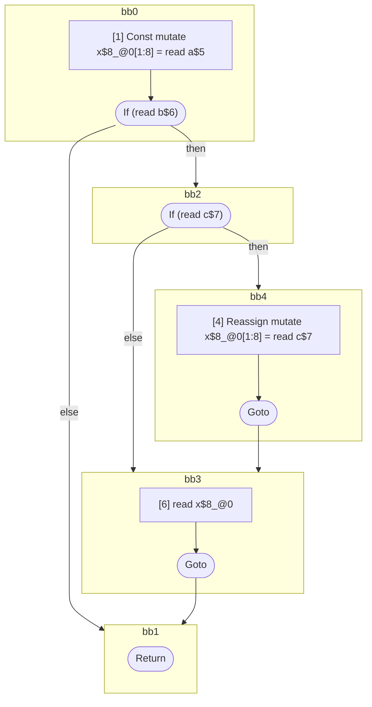

## Input

```javascript
function foo(a, b, c) {
  let x = a;
  if (b) {
    if (c) {
      x = c;
    }
    x;
  }
}

```

## HIR

```
bb0:
  [1] Const mutate x$8_@0[1:8] = read a$5
  [2] If (read b$6) then:bb2 else:bb1 fallthrough=bb1
bb2:
  predecessor blocks: bb0
  [3] If (read c$7) then:bb4 else:bb3 fallthrough=bb3
bb4:
  predecessor blocks: bb2
  [4] Reassign mutate x$8_@0[1:8] = read c$7
  [5] Goto bb3
bb3:
  predecessor blocks: bb4 bb2
  [6] read x$8_@0
  [7] Goto bb1
bb1:
  predecessor blocks: bb3 bb0
  [8] Return
scope0 [1:8]:
  - dependency: read a$5
  - dependency: read c$7
  - dependency: read c$7
  - dependency: read b$6
```

## Reactive Scopes

```
function foo(
  a,
  b,
  c,
) {
  scope @0 [1:8] deps=[read a$5, read c$7, read c$7, read b$6] {
    [1] Const mutate x$8_@0[1:8] = read a$5
    if (read b$6) {
      if (read c$7) {
        [4] Reassign mutate x$8_@0[1:8] = read c$7
      }
      [6] read x$8_@0
    }
  }
  return
}

```

### CFG



## Code

```javascript
function foo$0(a$5, b$6, c$7) {
  const x$8 = a$5;
  bb1: if (b$6) {
    bb3: if (c$7) {
      x$8 = c$7;
    }

    x$8;
  }
}

```
      