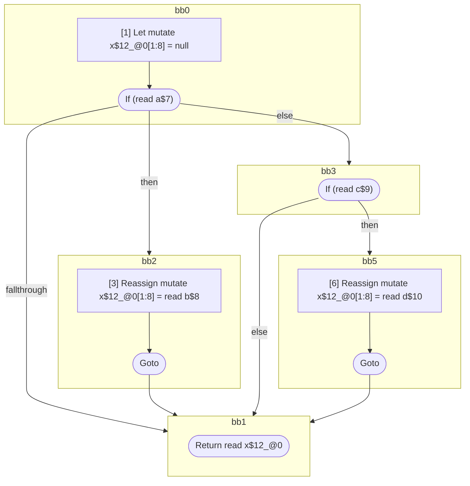

## Input

```javascript
function foo(a, b, c, d, e) {
  let x = null;
  if (a) {
    x = b;
  } else {
    if (c) {
      x = d;
    }
  }
  return x;
}

```

## HIR

```
bb0:
  [1] Let mutate x$12_@0[1:8] = null
  [2] If (read a$7) then:bb2 else:bb3 fallthrough=bb1
bb2:
  predecessor blocks: bb0
  [3] Reassign mutate x$12_@0[1:8] = read b$8
  [4] Goto bb1
bb3:
  predecessor blocks: bb0
  [5] If (read c$9) then:bb5 else:bb1 fallthrough=bb1
bb5:
  predecessor blocks: bb3
  [6] Reassign mutate x$12_@0[1:8] = read d$10
  [7] Goto bb1
bb1:
  predecessor blocks: bb2 bb5 bb3
  [8] Return read x$12_@0
scope0 [1:8]:
  - dependency: read b$8
  - dependency: read d$10
  - dependency: read c$9
  - dependency: read a$7
```

### CFG



## Code

```javascript
function foo$0(a$7, b$8, c$9, d$10, e$11) {
  let x$12 = null;
  bb1: if (a$7) {
    x$12 = b$8;
  } else {
    if (c$9) {
      x$12 = d$10;
    }
  }

  return x$12;
}

```
      