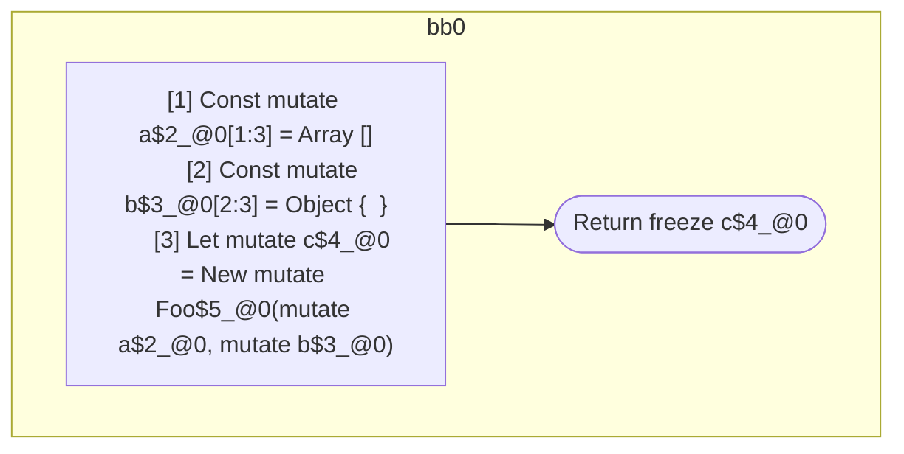

## Input

```javascript
function Foo() {}

function Component(props) {
  const a = [];
  const b = {};
  let c = new Foo(a, b);
  return c;
}

```

## HIR

```
bb0:
  Return
```

### CFG


## Code

```javascript
function Foo$0() {
  return;
}

```
## HIR

```
bb0:
  [1] Const mutate a$2_@0[1:3] = Array []
  [2] Const mutate b$3_@0[2:3] = Object {  }
  [3] Let mutate c$4_@0 = New mutate Foo$5_@0(mutate a$2_@0, mutate b$3_@0)
  Return freeze c$4_@0
```

### CFG



## Code

```javascript
function Component$0(props$1) {
  const a$2 = [];
  const b$3 = {};
  let c$4 = new Foo$5(a$2, b$3);
  return c$4;
}

```
      