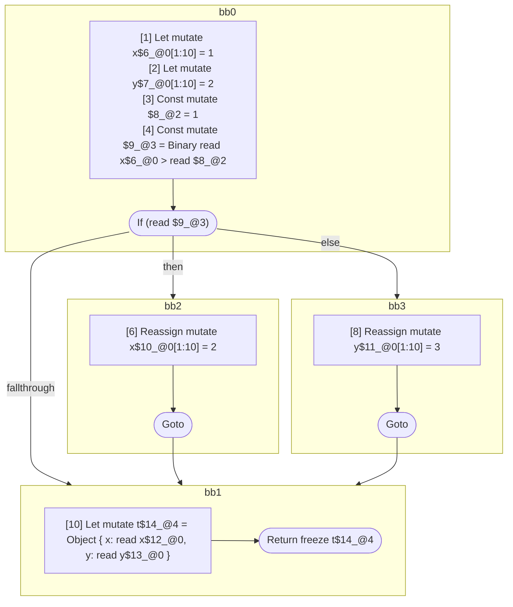

## Input

```javascript
function foo() {
  let x = 1;
  let y = 2;

  if (x > 1) {
    x = 2;
  } else {
    y = 3;
  }

  let t = { x: x, y: y };
  return t;
}

```

## HIR

```
bb0:
  [1] Let mutate x$6_@0[1:10] = 1
  [2] Let mutate y$7_@0[1:10] = 2
  [3] Const mutate $8_@2 = 1
  [4] Const mutate $9_@3 = Binary read x$6_@0 > read $8_@2
  [5] If (read $9_@3) then:bb2 else:bb3
bb2:
  predecessor blocks: bb0
  [6] Reassign mutate x$10_@0[1:10] = 2
  [7] Goto bb1
bb3:
  predecessor blocks: bb0
  [8] Reassign mutate y$11_@0[1:10] = 3
  [9] Goto bb1
bb1:
  predecessor blocks: bb2 bb3
  x$12_@0[1:10]: phi(bb2: x$10_@0, bb3: x$6_@0)
  y$13_@0[1:10]: phi(bb2: y$7_@0, bb3: y$11_@0)
  [10] Let mutate t$14_@4 = Object { x: read x$12_@0, y: read y$13_@0 }
  [11] Return freeze t$14_@4
scope3 [4:5]:
 - read $8_@2
```

### CFG



## Code

```javascript
function foo$0() {
  let x$1 = 1;
  let y$2 = 2;
  bb1: if (x$1 > 1) {
    x$1 = 2;
  } else {
    y$2 = 3;
  }

  let t$5 = {
    x: x$1,
    y: y$2,
  };
  return t$5;
}

```
      