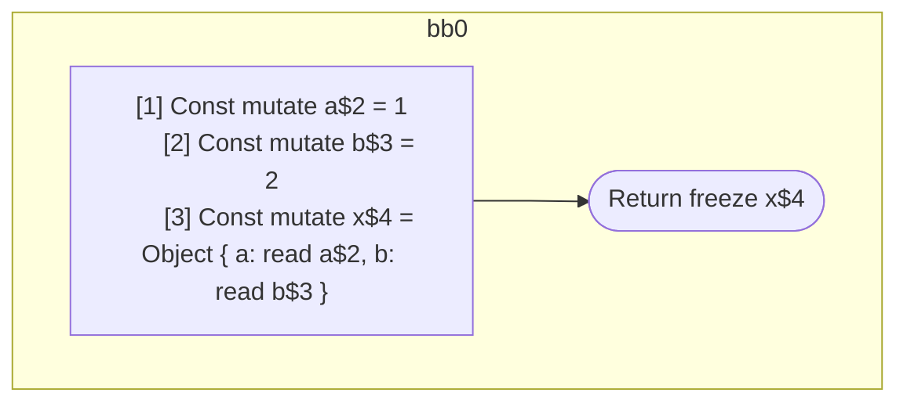

## Input

```javascript
function Component(props) {
  const a = 1;
  const b = 2;
  const x = { a: a, b: b };
  return x;
}

```

## HIR

```
bb0:
  [1] Const mutate a$2 = 1
  [2] Const mutate b$3 = 2
  [3] Const mutate x$4 = Object { a: read a$2, b: read b$3 }
  Return freeze x$4
```

### CFG



## Code

```javascript
function Component$0(props$1) {
  const a$2 = 1;
  const b$3 = 2;
  const x$4 = {
    a: a$2,
    b: b$3,
  };
  return x$4;
}

```
      