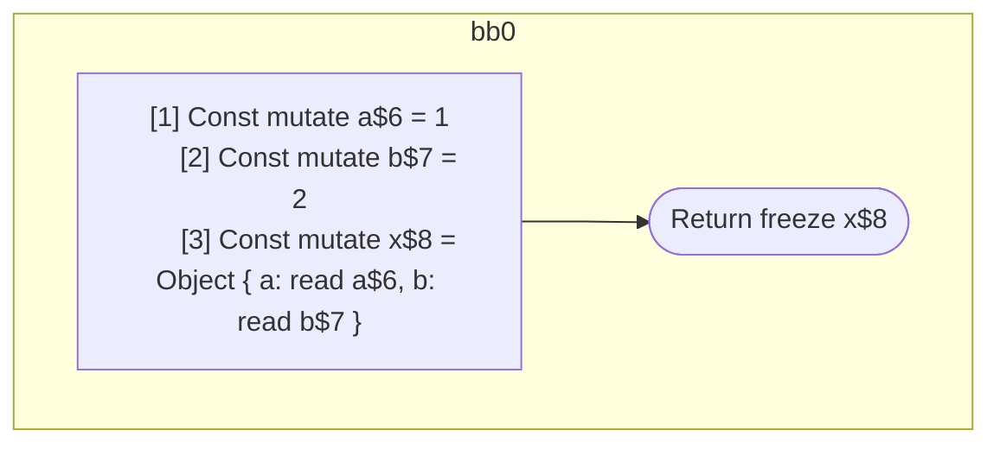

## Input

```javascript
function Component(props) {
  const a = 1;
  const b = 2;
  const x = { a: a, b: b };
  return x;
}

```

## HIR

```
bb0:
  [1] Const mutate a$6 = 1
  [2] Const mutate b$7 = 2
  [3] Const mutate x$8 = Object { a: read a$6, b: read b$7 }
  Return freeze x$8
```

### CFG



## Code

```javascript
function Component$0(props$5) {
  const a$6 = 1;
  const b$7 = 2;
  const x$8 = {
    a: a$6,
    b: b$7,
  };
  return x$8;
}

```
      