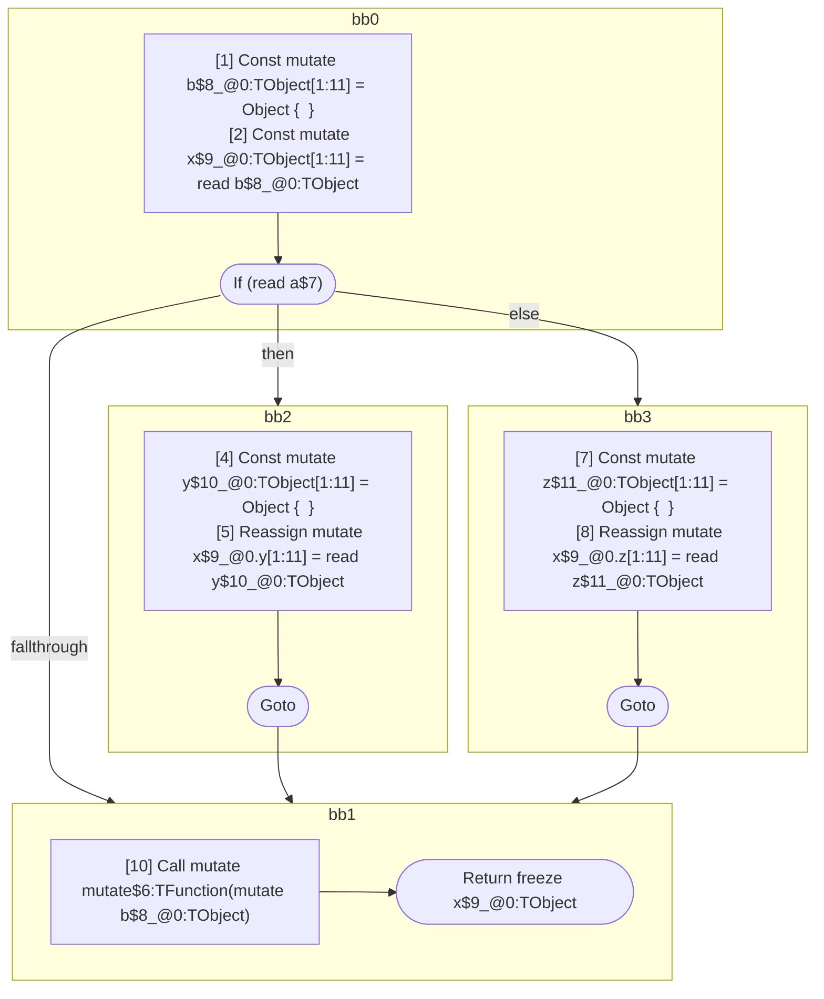

## Input

```javascript
function foo(a) {
  const b = {};
  const x = b;
  if (a) {
    let y = {};
    x.y = y;
  } else {
    let z = {};
    x.z = z;
  }
  mutate(b); // aliases x, y & z
  return x;
}

```

## HIR

```
bb0:
  [1] Const mutate b$8_@0:TObject[1:11] = Object {  }
  [2] Const mutate x$9_@0:TObject[1:11] = read b$8_@0:TObject
  [3] If (read a$7) then:bb2 else:bb3 fallthrough=bb1
bb2:
  predecessor blocks: bb0
  [4] Const mutate y$10_@0:TObject[1:11] = Object {  }
  [5] Reassign mutate x$9_@0.y[1:11] = read y$10_@0:TObject
  [6] Goto bb1
bb3:
  predecessor blocks: bb0
  [7] Const mutate z$11_@0:TObject[1:11] = Object {  }
  [8] Reassign mutate x$9_@0.z[1:11] = read z$11_@0:TObject
  [9] Goto bb1
bb1:
  predecessor blocks: bb2 bb3
  [10] Call mutate mutate$6:TFunction(mutate b$8_@0:TObject)
  [11] Return freeze x$9_@0:TObject
scope0 [1:11]:
  - dependency: read a$7
```

## Reactive Scopes

```
function foo(
  a,
) {
  scope @0 [1:11] deps=[read a$7] {
    [1] Const mutate b$8_@0:TObject[1:11] = Object {  }
    [2] Const mutate x$9_@0:TObject[1:11] = read b$8_@0:TObject
    if (read a$7) {
      [4] Const mutate y$10_@0:TObject[1:11] = Object {  }
      [5] Reassign mutate x$9_@0.y[1:11] = read y$10_@0:TObject
    } else {
      [7] Const mutate z$11_@0:TObject[1:11] = Object {  }
      [8] Reassign mutate x$9_@0.z[1:11] = read z$11_@0:TObject
    }
    [10] Call mutate mutate$6:TFunction(mutate b$8_@0:TObject)
  }
  return freeze x$9_@0:TObject
}

```

### CFG



## Code

```javascript
function foo$0(a$7) {
  const b$8 = {};
  const x$9 = b$8;
  bb1: if (a$7) {
    const y$10 = {};
    x$9.y = y$10;
  } else {
    const z$11 = {};
    x$9.z = z$11;
  }

  mutate$6(b$8);
  return x$9;
}

```
      