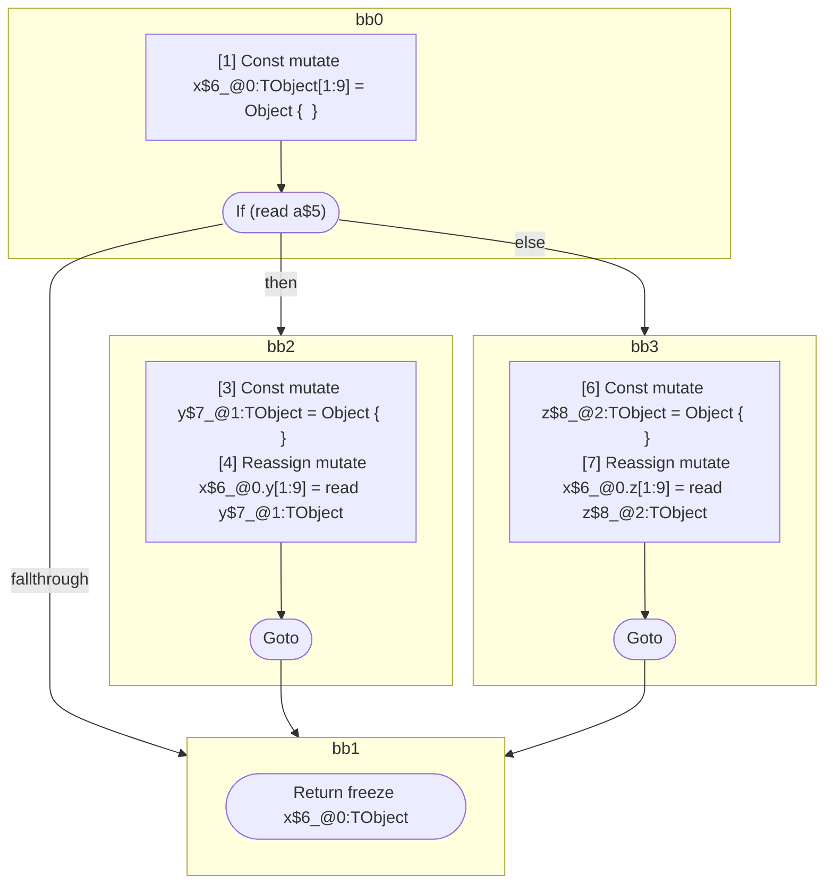

## Input

```javascript
function foo(a) {
  const x = {};
  if (a) {
    let y = {};
    x.y = y;
  } else {
    let z = {};
    x.z = z;
  }
  return x;
}

```

## HIR

```
bb0:
  [1] Const mutate x$6_@0:TObject[1:9] = Object {  }
  [2] If (read a$5) then:bb2 else:bb3 fallthrough=bb1
bb2:
  predecessor blocks: bb0
  [3] Const mutate y$7_@1:TObject = Object {  }
  [4] Reassign mutate x$6_@0.y[1:9] = read y$7_@1:TObject
  [5] Goto bb1
bb3:
  predecessor blocks: bb0
  [6] Const mutate z$8_@2:TObject = Object {  }
  [7] Reassign mutate x$6_@0.z[1:9] = read z$8_@2:TObject
  [8] Goto bb1
bb1:
  predecessor blocks: bb2 bb3
  [9] Return freeze x$6_@0:TObject
scope0 [1:9]:
  - dependency: read a$5
scope1 [3:4]:
  - dependency: mutate x$6_@0.y
scope2 [6:7]:
  - dependency: mutate x$6_@0.z
```

## Reactive Scopes

```
function foo(
  a,
) {
  scope @0 [1:9] deps=[read a$5] {
    [1] Const mutate x$6_@0:TObject[1:9] = Object {  }
    if (read a$5) {
      scope @1 [3:4] deps=[mutate x$6_@0.y] {
        [3] Const mutate y$7_@1:TObject = Object {  }
      }
      [4] Reassign mutate x$6_@0.y[1:9] = read y$7_@1:TObject
    } else {
      scope @2 [6:7] deps=[mutate x$6_@0.z] {
        [6] Const mutate z$8_@2:TObject = Object {  }
      }
      [7] Reassign mutate x$6_@0.z[1:9] = read z$8_@2:TObject
    }
  }
  return freeze x$6_@0:TObject
}

```

### CFG



## Code

```javascript
function foo$0(a$5) {
  const x$6 = {};
  bb1: if (a$5) {
    const y$7 = {};
    x$6.y = y$7;
  } else {
    const z$8 = {};
    x$6.z = z$8;
  }

  return x$6;
}

```
      