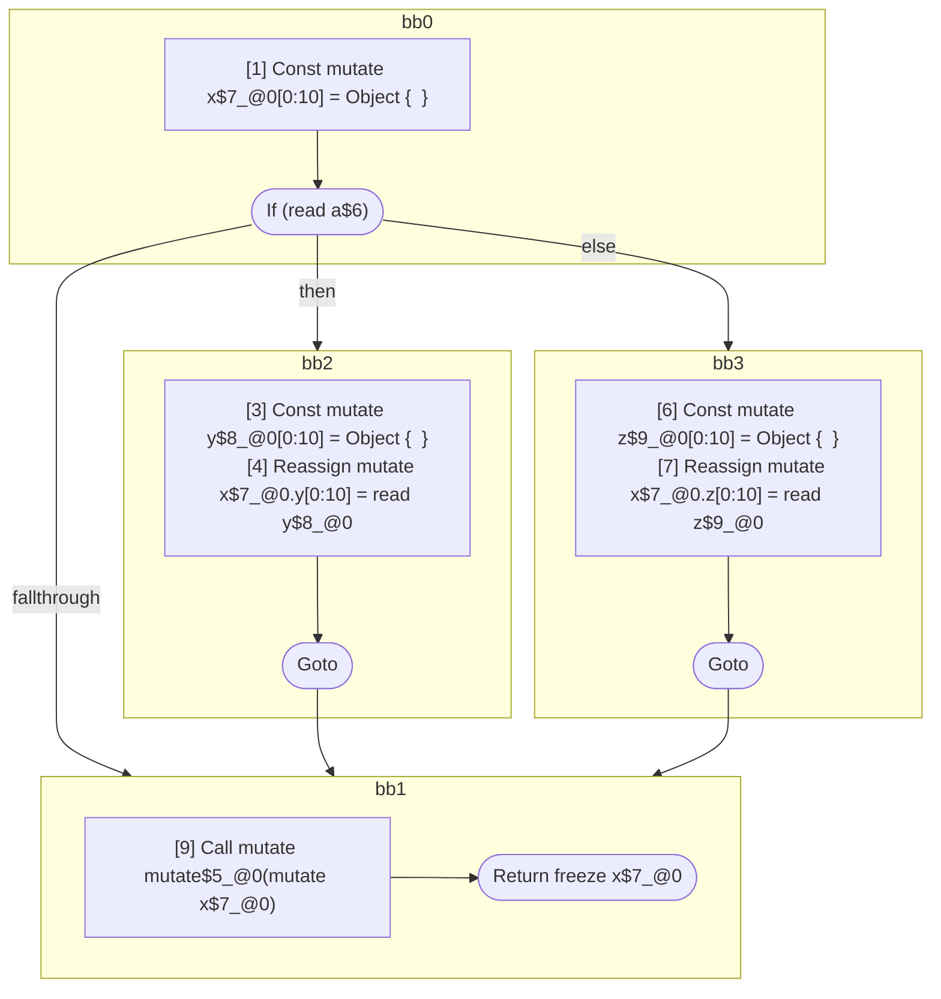

## Input

```javascript
function foo(a) {
  const x = {};
  if (a) {
    let y = {};
    x.y = y;
  } else {
    let z = {};
    x.z = z;
  }
  mutate(x);
  return x;
}

```

## HIR

```
bb0:
  [1] Const mutate x$7_@0[0:10] = Object {  }
  [2] If (read a$6) then:bb2 else:bb3 fallthrough=bb1
bb2:
  predecessor blocks: bb0
  [3] Const mutate y$8_@0[0:10] = Object {  }
  [4] Reassign mutate x$7_@0.y[0:10] = read y$8_@0
  [5] Goto bb1
bb3:
  predecessor blocks: bb0
  [6] Const mutate z$9_@0[0:10] = Object {  }
  [7] Reassign mutate x$7_@0.z[0:10] = read z$9_@0
  [8] Goto bb1
bb1:
  predecessor blocks: bb2 bb3
  [9] Call mutate mutate$5_@0(mutate x$7_@0)
  [10] Return freeze x$7_@0

```

### CFG



## Code

```javascript
function foo$0(a$6) {
  const x$7 = {};
  bb1: if (a$6) {
    const y$8 = {};
    x$7.y = y$8;
  } else {
    const z$9 = {};
    x$7.z = z$9;
  }

  mutate$5(x$7);
  return x$7;
}

```
      