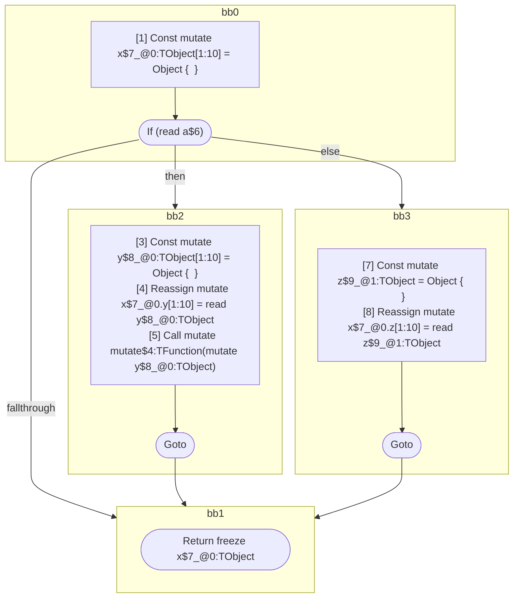

## Input

```javascript
function foo(a) {
  const x = {};
  if (a) {
    let y = {};
    x.y = y;
    mutate(y); // aliases x & y, but not z
  } else {
    let z = {};
    x.z = z;
  }
  return x;
}

```

## HIR

```
bb0:
  [1] Const mutate x$7_@0:TObject[1:10] = Object {  }
  [2] If (read a$6) then:bb2 else:bb3 fallthrough=bb1
bb2:
  predecessor blocks: bb0
  [3] Const mutate y$8_@0:TObject[1:10] = Object {  }
  [4] Reassign mutate x$7_@0.y[1:10] = read y$8_@0:TObject
  [5] Call mutate mutate$4:TFunction(mutate y$8_@0:TObject)
  [6] Goto bb1
bb3:
  predecessor blocks: bb0
  [7] Const mutate z$9_@1:TObject = Object {  }
  [8] Reassign mutate x$7_@0.z[1:10] = read z$9_@1:TObject
  [9] Goto bb1
bb1:
  predecessor blocks: bb2 bb3
  [10] Return freeze x$7_@0:TObject
scope0 [1:10]:
  - dependency: read a$6
scope1 [7:8]:
  - dependency: mutate x$7_@0.z
```

## Reactive Scopes

```
function foo(
  a,
) {
  scope @0 [1:10] deps=[read a$6] {
    [1] Const mutate x$7_@0:TObject[1:10] = Object {  }
    if (read a$6) {
      [3] Const mutate y$8_@0:TObject[1:10] = Object {  }
      [4] Reassign mutate x$7_@0.y[1:10] = read y$8_@0:TObject
      [5] Call mutate mutate$4:TFunction(mutate y$8_@0:TObject)
    } else {
      scope @1 [7:8] deps=[mutate x$7_@0.z] {
        [7] Const mutate z$9_@1:TObject = Object {  }
      }
      [8] Reassign mutate x$7_@0.z[1:10] = read z$9_@1:TObject
    }
  }
  return freeze x$7_@0:TObject
}

```

### CFG



## Code

```javascript
function foo$0(a$6) {
  const x$7 = {};
  bb1: if (a$6) {
    const y$8 = {};
    x$7.y = y$8;
    mutate$4(y$8);
  } else {
    const z$9 = {};
    x$7.z = z$9;
  }

  return x$7;
}

```
      