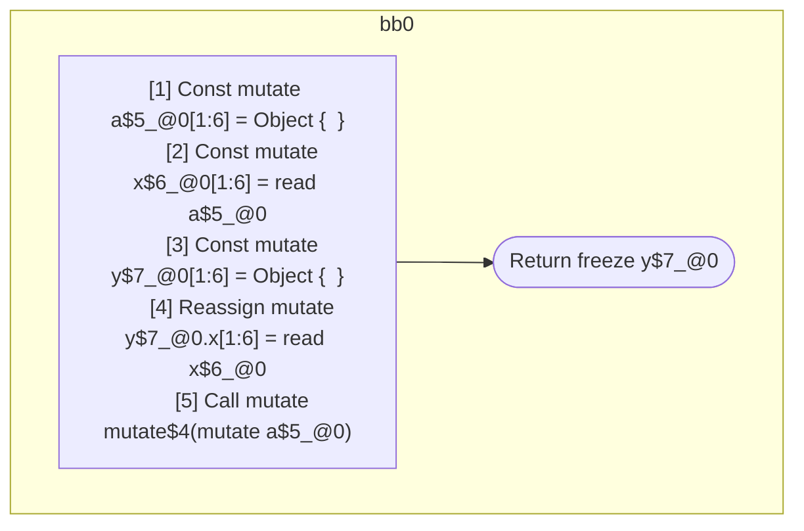

## Input

```javascript
function foo() {
  const a = {};
  const x = a;

  const y = {};
  y.x = x;

  mutate(a); // y & x are aliased to a
  return y;
}

```

## HIR

```
bb0:
  [1] Const mutate a$5_@0[1:6] = Object {  }
  [2] Const mutate x$6_@0[1:6] = read a$5_@0
  [3] Const mutate y$7_@0[1:6] = Object {  }
  [4] Reassign mutate y$7_@0.x[1:6] = read x$6_@0
  [5] Call mutate mutate$4(mutate a$5_@0)
  [6] Return freeze y$7_@0

```

## Reactive Scopes

```
function foo(
) {
  scope @0 [1:6] deps=[] {
    [1] Const mutate a$5_@0[1:6] = Object {  }
    [2] Const mutate x$6_@0[1:6] = read a$5_@0
    [3] Const mutate y$7_@0[1:6] = Object {  }
    [4] Reassign mutate y$7_@0.x[1:6] = read x$6_@0
    [5] Call mutate mutate$4(mutate a$5_@0)
  }
  return freeze y$7_@0
}

```

### CFG



## Code

```javascript
function foo$0() {
  const a$5 = {};
  const x$6 = a$5;
  const y$7 = {};
  y$7.x = x$6;
  mutate$4(a$5);
  return y$7;
}

```
      