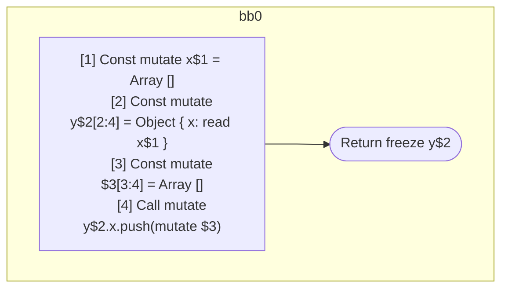

## Input

```javascript
function foo() {
  const x = [];
  const y = { x: x };
  y.x.push([]);
  return y;
}

```

## HIR

```
bb0:
  [1] Const mutate x$1 = Array []
  [2] Const mutate y$2[2:4] = Object { x: read x$1 }
  [3] Const mutate $3[3:4] = Array []
  [4] Call mutate y$2.x.push(mutate $3)
  Return freeze y$2
```

### CFG



## Code

```javascript
function foo$0() {
  const x$1 = [];
  const y$2 = {
    x: x$1,
  };
  y$2.x.push([]);
  return y$2;
}

```
      