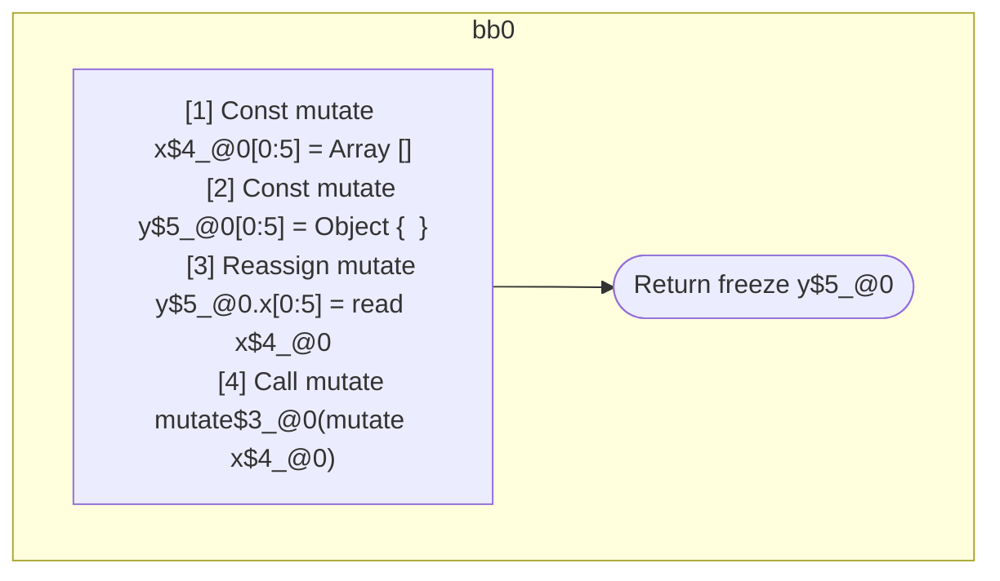

## Input

```javascript
function foo() {
  const x = [];
  const y = {};
  y.x = x;
  mutate(x);
  return y;
}

```

## HIR

```
bb0:
  [1] Const mutate x$4_@0[0:5] = Array []
  [2] Const mutate y$5_@0[0:5] = Object {  }
  [3] Reassign mutate y$5_@0.x[0:5] = read x$4_@0
  [4] Call mutate mutate$3_@0(mutate x$4_@0)
  [5] Return freeze y$5_@0

```

### CFG



## Code

```javascript
function foo$0() {
  const x$4 = [];
  const y$5 = {};
  y$5.x = x$4;
  mutate$3(x$4);
  return y$5;
}

```
      