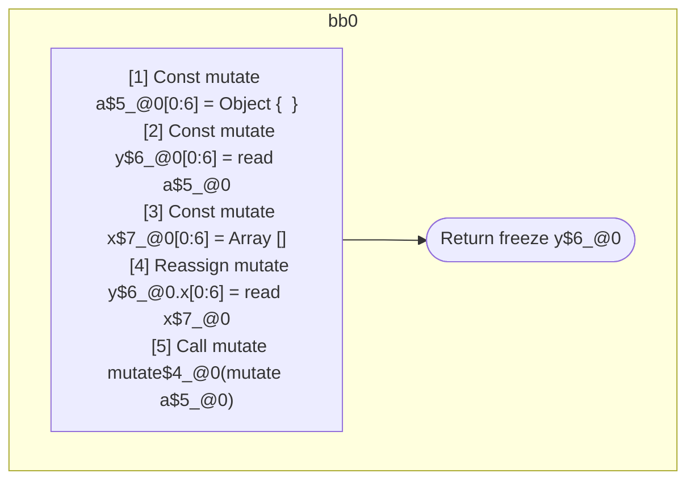

## Input

```javascript
function foo() {
  const a = {};
  const y = a;
  const x = [];

  y.x = x;

  mutate(a); // y & x are aliased to a
  return y;
}

```

## HIR

```
bb0:
  [1] Const mutate a$5_@0[0:6] = Object {  }
  [2] Const mutate y$6_@0[0:6] = read a$5_@0
  [3] Const mutate x$7_@0[0:6] = Array []
  [4] Reassign mutate y$6_@0.x[0:6] = read x$7_@0
  [5] Call mutate mutate$4_@0(mutate a$5_@0)
  [6] Return freeze y$6_@0

```

### CFG



## Code

```javascript
function foo$0() {
  const a$5 = {};
  const y$6 = a$5;
  const x$7 = [];
  y$6.x = x$7;
  mutate$4(a$5);
  return y$6;
}

```
      