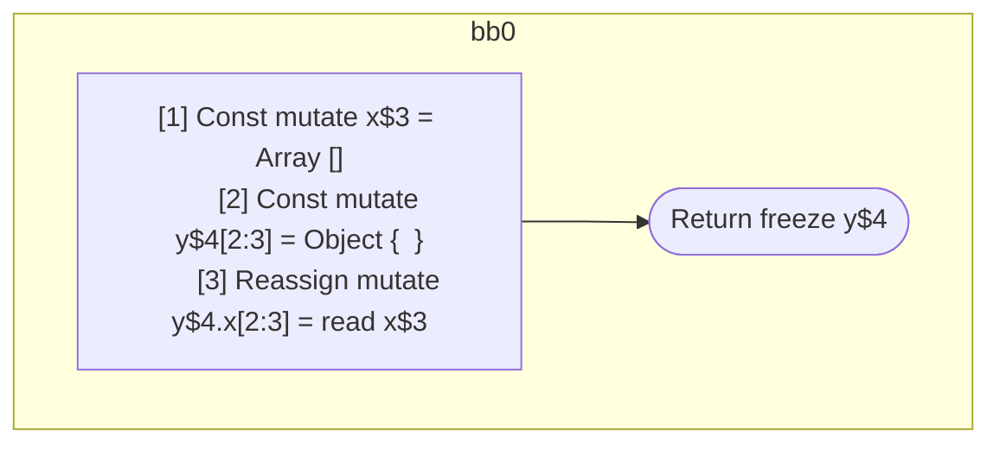

## Input

```javascript
function foo() {
  const x = [];
  const y = {};
  y.x = x;
  return y;
}

```

## HIR

```
bb0:
  [1] Const mutate x$3 = Array []
  [2] Const mutate y$4[2:3] = Object {  }
  [3] Reassign mutate y$4.x[2:3] = read x$3
  Return freeze y$4
```

### CFG



## Code

```javascript
function foo$0() {
  const x$3 = [];
  const y$4 = {};
  y$4 = x$3;
  return y$4;
}

```
      