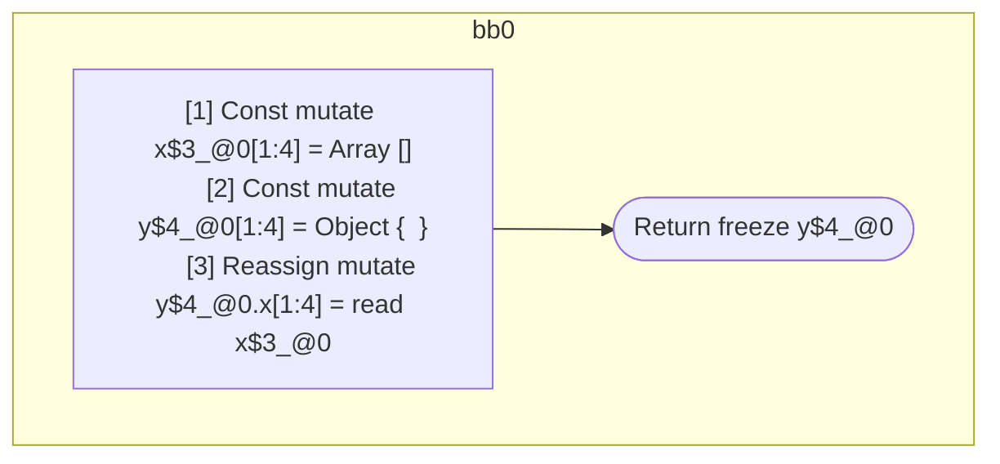

## Input

```javascript
function foo() {
  const x = [];
  const y = {};
  y.x = x;
  return y;
}

```

## HIR

```
bb0:
  [1] Const mutate x$3_@0[1:4] = Array []
  [2] Const mutate y$4_@0[1:4] = Object {  }
  [3] Reassign mutate y$4_@0.x[1:4] = read x$3_@0
  [4] Return freeze y$4_@0

```

### CFG



## Code

```javascript
function foo$0() {
  const x$1 = [];
  const y$2 = {};
  y$2.x = x$1;
  return y$2;
}

```
      