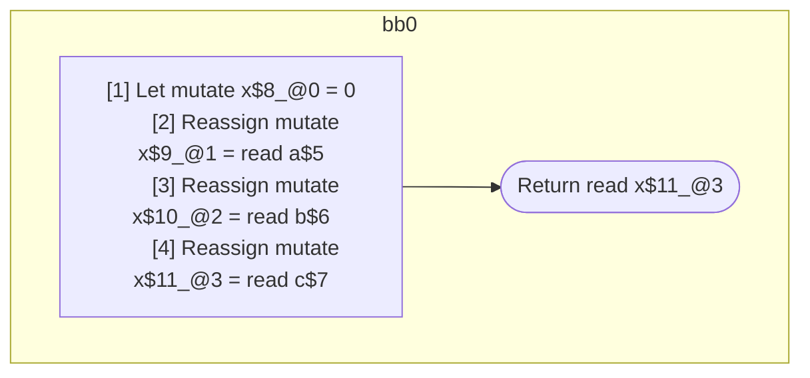

## Input

```javascript
function foo(a, b, c) {
  let x = 0;
  x = a;
  x = b;
  x = c;
  return x;
}

```

## HIR

```
bb0:
  [1] Let mutate x$8_@0 = 0
  [2] Reassign mutate x$9_@1 = read a$5
  [3] Reassign mutate x$10_@2 = read b$6
  [4] Reassign mutate x$11_@3 = read c$7
  [5] Return read x$11_@3
scope1 [2:3]:
 - read a$5
scope2 [3:4]:
 - read b$6
scope3 [4:5]:
 - read c$7
```

### CFG



## Code

```javascript
function foo$0(a$5, b$6, c$7) {
  const x$8 = 0;
  const x$9 = a$5;
  const x$10 = b$6;
  const x$11 = c$7;
  return x$11;
}

```
      