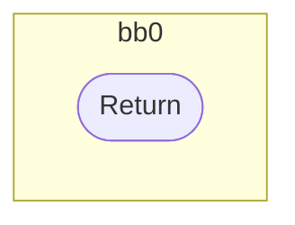
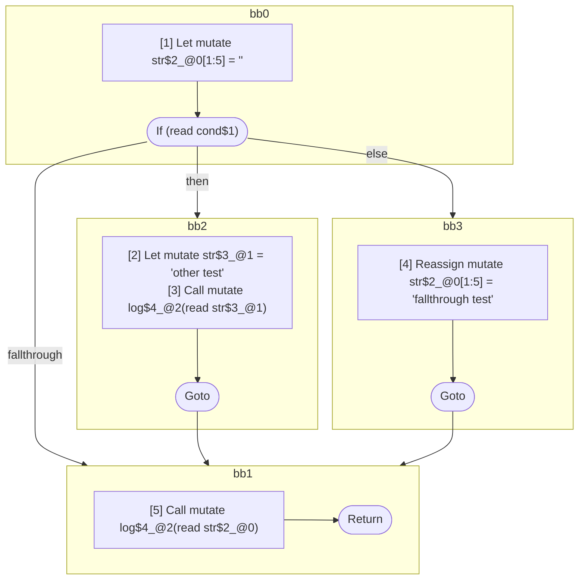

## Input

```javascript
function log() {}

function Foo(cond) {
  let str = "";
  if (cond) {
    let str = "other test";
    log(str);
  } else {
    str = "fallthrough test";
  }
  log(str);
}

```

## HIR

```
bb0:
  Return
```

### CFG



## Code

```javascript
function log$0() {
  return;
}

```
## HIR

```
bb0:
  [1] Let mutate str$2_@0[1:5] = ""
  If (read cond$1) then:bb2 else:bb3
bb2:
  predecessor blocks: bb0
  [2] Let mutate str$3_@1 = "other test"
  [3] Call mutate log$4_@2(read str$3_@1)
  Goto bb1
bb3:
  predecessor blocks: bb0
  [4] Reassign mutate str$2_@0[1:5] = "fallthrough test"
  Goto bb1
bb1:
  predecessor blocks: bb2 bb3
  [5] Call mutate log$4_@2(read str$2_@0)
  Return
```

### CFG



## Code

```javascript
function Foo$0(cond$1) {
  let str$2 = "";
  bb1: if (cond$1) {
    let str$3 = "other test";
    log$4(str$3);
  } else {
    str$2 = "fallthrough test";
  }

  log$4(str$2);
  return;
}

```
      