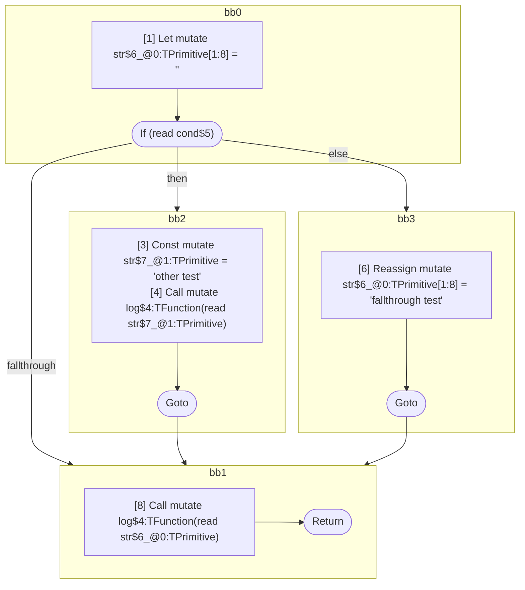

## Input

```javascript
function log() {}

function Foo(cond) {
  let str = "";
  if (cond) {
    let str = "other test";
    log(str);
  } else {
    str = "fallthrough test";
  }
  log(str);
}

```

## HIR

```
bb0:
  [1] Return

```

## Reactive Scopes

```
function log(
) {
  return
}

```

### CFG


## Code

```javascript
function log$0() {}

```
## HIR

```
bb0:
  [1] Let mutate str$6_@0:TPrimitive[1:8] = ""
  [2] If (read cond$5) then:bb2 else:bb3 fallthrough=bb1
bb2:
  predecessor blocks: bb0
  [3] Const mutate str$7_@1:TPrimitive = "other test"
  [4] Call mutate log$4:TFunction(read str$7_@1:TPrimitive)
  [5] Goto bb1
bb3:
  predecessor blocks: bb0
  [6] Reassign mutate str$6_@0:TPrimitive[1:8] = "fallthrough test"
  [7] Goto bb1
bb1:
  predecessor blocks: bb2 bb3
  [8] Call mutate log$4:TFunction(read str$6_@0:TPrimitive)
  [9] Return
scope0 [1:8]:
  - dependency: read cond$5
```

## Reactive Scopes

```
function Foo(
  cond,
) {
  scope @0 [1:8] deps=[read cond$5] {
    [1] Let mutate str$6_@0:TPrimitive[1:8] = ""
    if (read cond$5) {
      [3] Const mutate str$7_@1:TPrimitive = "other test"
      [4] Call mutate log$4:TFunction(read str$7_@1:TPrimitive)
    } else {
      [6] Reassign mutate str$6_@0:TPrimitive[1:8] = "fallthrough test"
    }
  }
  [8] Call mutate log$4:TFunction(read str$6_@0:TPrimitive)
  return
}

```

### CFG



## Code

```javascript
function Foo$0(cond$5) {
  let str$6 = "";
  bb1: if (cond$5) {
    const str$7 = "other test";
    log$4(str$7);
  } else {
    str$6 = "fallthrough test";
  }

  log$4(str$6);
}

```
      