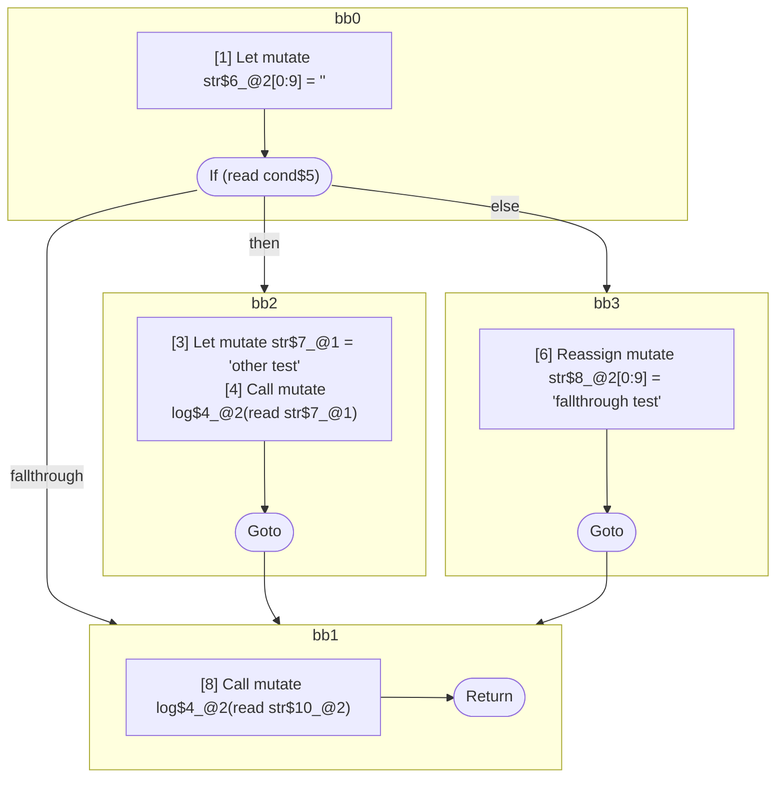

## Input

```javascript
function log() {}

function Foo(cond) {
  let str = "";
  if (cond) {
    let str = "other test";
    log(str);
  } else {
    str = "fallthrough test";
  }
  log(str);
}

```

## HIR

```
bb0:
  [1] Return
```

### CFG


## Code

```javascript
function log$0() {}

```
## HIR

```
bb0:
  [1] Let mutate str$6_@2[0:9] = ""
  [2] If (read cond$5) then:bb2 else:bb3
bb2:
  predecessor blocks: bb0
  [3] Let mutate str$7_@1 = "other test"
  [4] Call mutate log$4_@2(read str$7_@1)
  [5] Goto bb1
bb3:
  predecessor blocks: bb0
  [6] Reassign mutate str$8_@2[0:9] = "fallthrough test"
  [7] Goto bb1
bb1:
  predecessor blocks: bb2 bb3
  str$10_@2[0:9]: phi(bb2: str$6_@2, bb3: str$8_@2)
  [8] Call mutate log$4_@2(read str$10_@2)
  [9] Return
```

### CFG



## Code

```javascript
function Foo$0(cond$1) {
  let str$2 = "";
  bb1: if (cond$1) {
    let str$3 = "other test";
    log$4(str$3);
  } else {
    str$2 = "fallthrough test";
  }

  log$4(str$2);
}

```
      