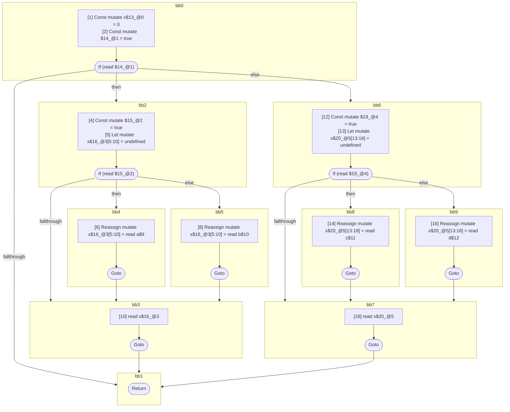

## Input

```javascript
function foo(a, b, c, d) {
  let x = 0;
  if (true) {
    if (true) {
      x = a;
    } else {
      x = b;
    }
    x;
  } else {
    if (true) {
      x = c;
    } else {
      x = d;
    }
    x;
  }
  // note: intentionally no phi here so that there are two distinct phis above
}

```

## HIR

```
bb0:
  [1] Const mutate x$13_@0 = 0
  [2] Const mutate $14_@1 = true
  [3] If (read $14_@1) then:bb2 else:bb6 fallthrough=bb1
bb2:
  predecessor blocks: bb0
  [4] Const mutate $15_@2 = true
  [5] Let mutate x$16_@3[5:10] = undefined
  [5] If (read $15_@2) then:bb4 else:bb5 fallthrough=bb3
bb4:
  predecessor blocks: bb2
  [6] Reassign mutate x$16_@3[5:10] = read a$9
  [7] Goto bb3
bb5:
  predecessor blocks: bb2
  [8] Reassign mutate x$16_@3[5:10] = read b$10
  [9] Goto bb3
bb3:
  predecessor blocks: bb4 bb5
  [10] read x$16_@3
  [11] Goto bb1
bb6:
  predecessor blocks: bb0
  [12] Const mutate $19_@4 = true
  [13] Let mutate x$20_@5[13:18] = undefined
  [13] If (read $19_@4) then:bb8 else:bb9 fallthrough=bb7
bb8:
  predecessor blocks: bb6
  [14] Reassign mutate x$20_@5[13:18] = read c$11
  [15] Goto bb7
bb9:
  predecessor blocks: bb6
  [16] Reassign mutate x$20_@5[13:18] = read d$12
  [17] Goto bb7
bb7:
  predecessor blocks: bb8 bb9
  [18] read x$20_@5
  [19] Goto bb1
bb1:
  predecessor blocks: bb3 bb7
  [20] Return
scope3 [5:10]:
 - read a$9
 - read b$10
 - read $15_@2
scope5 [13:18]:
 - read c$11
 - read d$12
 - read $19_@4
```

### CFG



## Code

```javascript
function foo$0(a$9, b$10, c$11, d$12) {
  const x$13 = 0;
  bb1: if (true) {
    let x$16 = undefined;

    bb3: if (true) {
      x$16 = a$9;
    } else {
      x$16 = b$10;
    }

    x$16;
  } else {
    let x$20 = undefined;

    bb7: if (true) {
      x$20 = c$11;
    } else {
      x$20 = d$12;
    }

    x$20;
  }
}

```
      