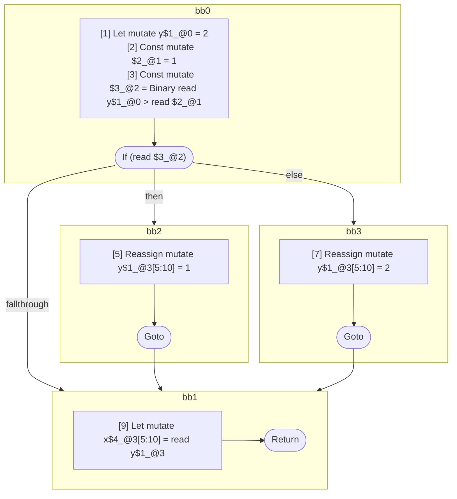

## Input

```javascript
function foo() {
  let y = 2;

  if (y > 1) {
    y = 1;
  } else {
    y = 2;
  }

  let x = y;
}

```

## HIR

```
bb0:
  [1] Let mutate y$1_@0 = 2
  [2] Const mutate $2_@1 = 1
  [3] Const mutate $3_@2 = Binary read y$1_@0 > read $2_@1
  [4] If (read $3_@2) then:bb2 else:bb3
bb2:
  predecessor blocks: bb0
  [5] Reassign mutate y$1_@3[5:10] = 1
  [6] Goto bb1
bb3:
  predecessor blocks: bb0
  [7] Reassign mutate y$1_@3[5:10] = 2
  [8] Goto bb1
bb1:
  predecessor blocks: bb2 bb3
  [9] Let mutate x$4_@3[5:10] = read y$1_@3
  [10] Return
```

### CFG



## Code

```javascript
function foo$0() {
  let y$1 = 2;
  bb1: if (y$1 > 1) {
    y$1 = 1;
  } else {
    y$1 = 2;
  }

  let x$4 = y$1;
  return;
}

```
      