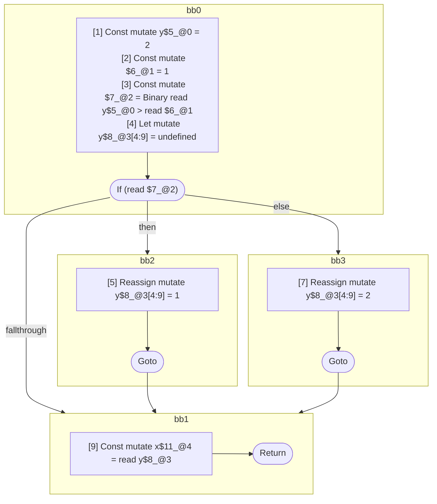

## Input

```javascript
function foo() {
  let y = 2;

  if (y > 1) {
    y = 1;
  } else {
    y = 2;
  }

  let x = y;
}

```

## HIR

```
bb0:
  [1] Const mutate y$5_@0 = 2
  [2] Const mutate $6_@1 = 1
  [3] Const mutate $7_@2 = Binary read y$5_@0 > read $6_@1
  [4] Let mutate y$8_@3[4:9] = undefined
  [4] If (read $7_@2) then:bb2 else:bb3 fallthrough=bb1
bb2:
  predecessor blocks: bb0
  [5] Reassign mutate y$8_@3[4:9] = 1
  [6] Goto bb1
bb3:
  predecessor blocks: bb0
  [7] Reassign mutate y$8_@3[4:9] = 2
  [8] Goto bb1
bb1:
  predecessor blocks: bb2 bb3
  [9] Const mutate x$11_@4 = read y$8_@3
  [10] Return
scope2 [3:4]:
  - dependency: read y$5_@0
  - dependency: read $6_@1
scope3 [4:9]:
  - dependency: read $7_@2
scope4 [9:10]:
  - dependency: read y$8_@3
```

### CFG



## Code

```javascript
function foo$0() {
  const y$5 = 2;
  let y$8 = undefined;
  bb1: if (y$5 > 1) {
    y$8 = 1;
  } else {
    y$8 = 2;
  }

  const x$11 = y$8;
}

```
      