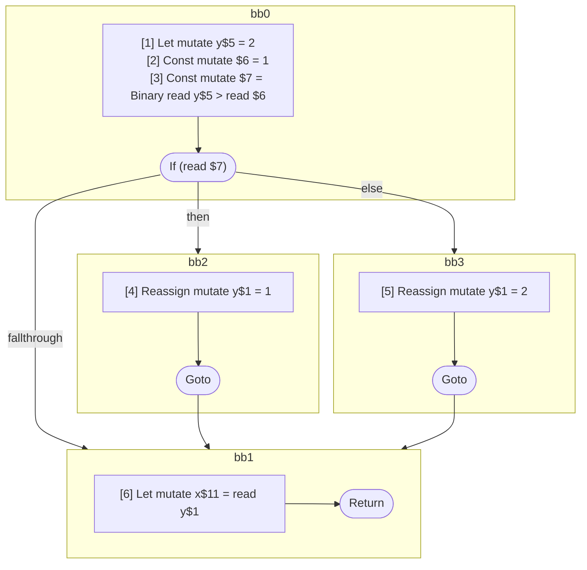

## Input

```javascript
function foo() {
  let y = 2;

  if (y > 1) {
    y = 1;
  } else {
    y = 2;
  }

  let x = y;
}

```

## HIR

```
bb0:
  [1] Let mutate y$5 = 2
  [2] Const mutate $6 = 1
  [3] Const mutate $7 = Binary read y$5 > read $6
  If (read $7) then:bb2 else:bb3
bb2:
  predecessor blocks: bb0
  [4] Reassign mutate y$1 = 1
  Goto bb1
bb3:
  predecessor blocks: bb0
  [5] Reassign mutate y$1 = 2
  Goto bb1
bb1:
  predecessor blocks: bb2 bb3
  [6] Let mutate x$11 = read y$1
  Return
```

### CFG



## Code

```javascript
function foo$0() {
  let y$5 = 2;
  bb1: if (y$5 > 1) {
    y$1 = 1;
  } else {
    y$1 = 2;
  }

  let x$11 = y$1;
  return;
}

```
      