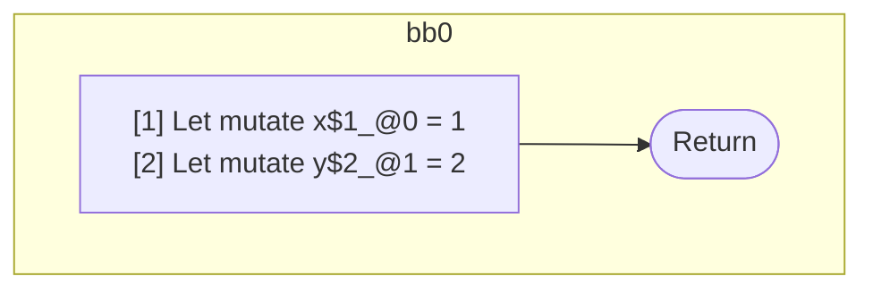

## Input

```javascript
function foo() {
  let x = 1;
  let y = 2;
}

```

## HIR

```
bb0:
  [1] Let mutate x$1_@0 = 1
  [2] Let mutate y$2_@1 = 2
  [3] Return
```

### CFG



## Code

```javascript
function foo$0() {
  let x$1 = 1;
  let y$2 = 2;
}

```
      