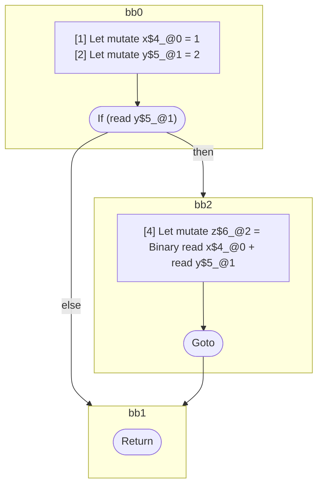

## Input

```javascript
function foo() {
  let x = 1;
  let y = 2;

  if (y) {
    let z = x + y;
  }
}

```

## HIR

```
bb0:
  [1] Let mutate x$4_@0 = 1
  [2] Let mutate y$5_@1 = 2
  [3] If (read y$5_@1) then:bb2 else:bb1
bb2:
  predecessor blocks: bb0
  [4] Let mutate z$6_@2 = Binary read x$4_@0 + read y$5_@1
  [5] Goto bb1
bb1:
  predecessor blocks: bb2 bb0
  [6] Return
```

### CFG



## Code

```javascript
function foo$0() {
  let x$1 = 1;
  let y$2 = 2;
  bb1: if (y$2) {
    let z$3 = x$1 + y$2;
  }
}

```
      