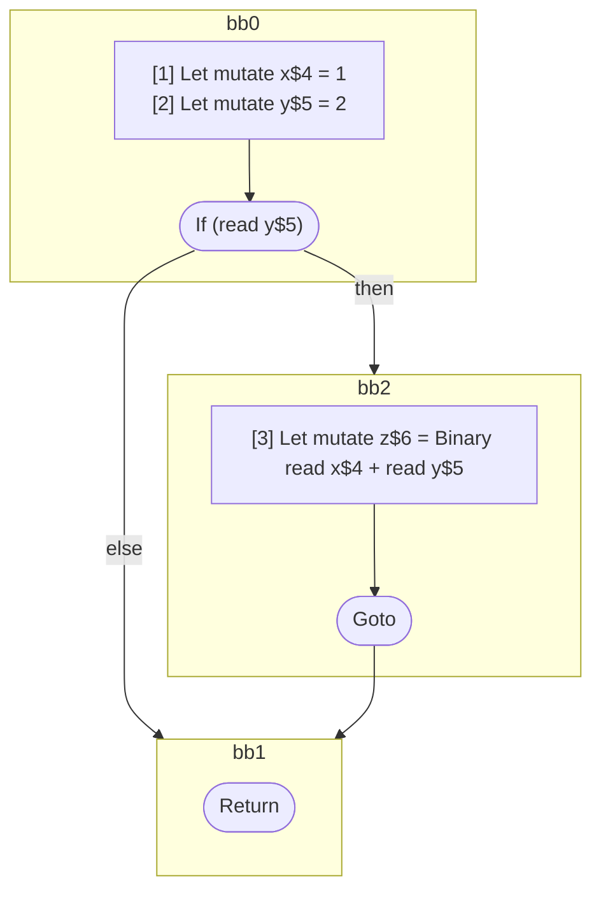

## Input

```javascript
function foo() {
  let x = 1;
  let y = 2;

  if (y) {
    let z = x + y;
  }
}

```

## HIR

```
bb0:
  [1] Let mutate x$4 = 1
  [2] Let mutate y$5 = 2
  If (read y$5) then:bb2 else:bb1
bb2:
  predecessor blocks: bb0
  [3] Let mutate z$6 = Binary read x$4 + read y$5
  Goto bb1
bb1:
  predecessor blocks: bb2 bb0
  Return
```

### CFG



## Code

```javascript
function foo$0() {
  let x$4 = 1;
  let y$5 = 2;
  bb1: if (y$5) {
    let z$6 = x$4 + y$5;
  }

  return;
}

```
      