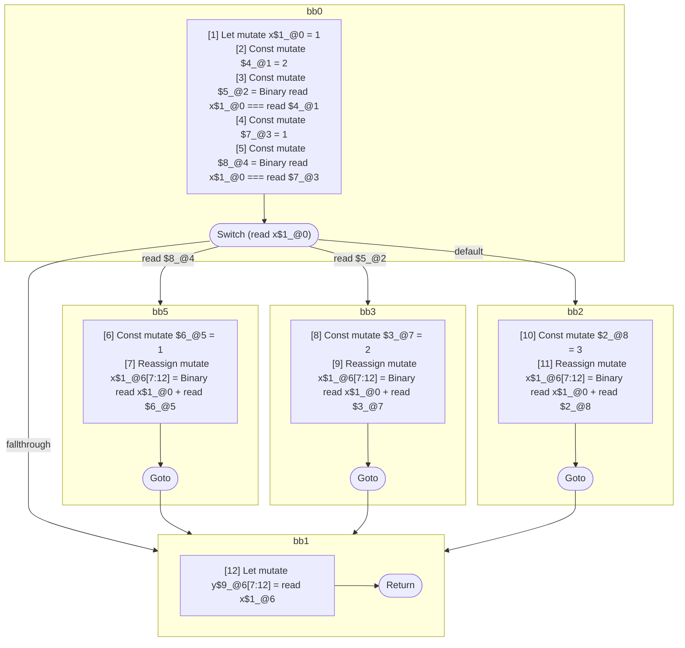

## Input

```javascript
function foo() {
  let x = 1;

  switch (x) {
    case x === 1: {
      x = x + 1;
      break;
    }
    case x === 2: {
      x = x + 2;
      break;
    }
    default: {
      x = x + 3;
    }
  }

  let y = x;
}

```

## HIR

```
bb0:
  [1] Let mutate x$1_@0 = 1
  [2] Const mutate $4_@1 = 2
  [3] Const mutate $5_@2 = Binary read x$1_@0 === read $4_@1
  [4] Const mutate $7_@3 = 1
  [5] Const mutate $8_@4 = Binary read x$1_@0 === read $7_@3
  Switch (read x$1_@0)
    Case read $8_@4: bb5
    Case read $5_@2: bb3
    Default: bb2
bb5:
  predecessor blocks: bb0
  [6] Const mutate $6_@5 = 1
  [7] Reassign mutate x$1_@6[7:12] = Binary read x$1_@0 + read $6_@5
  Goto bb1
bb3:
  predecessor blocks: bb0
  [8] Const mutate $3_@7 = 2
  [9] Reassign mutate x$1_@6[7:12] = Binary read x$1_@0 + read $3_@7
  Goto bb1
bb2:
  predecessor blocks: bb0
  [10] Const mutate $2_@8 = 3
  [11] Reassign mutate x$1_@6[7:12] = Binary read x$1_@0 + read $2_@8
  Goto bb1
bb1:
  predecessor blocks: bb5 bb3 bb2
  [12] Let mutate y$9_@6[7:12] = read x$1_@6
  Return
```

### CFG



## Code

```javascript
function foo$0() {
  let x$1 = 1;
  bb1: switch (x$1) {
    case x$1 === 1: {
      x$1 = x$1 + 1;
      break bb1;
    }

    case x$1 === 2: {
      x$1 = x$1 + 2;
      break bb1;
    }

    default: {
      x$1 = x$1 + 3;
    }
  }

  let y$9 = x$1;
  return;
}

```
      