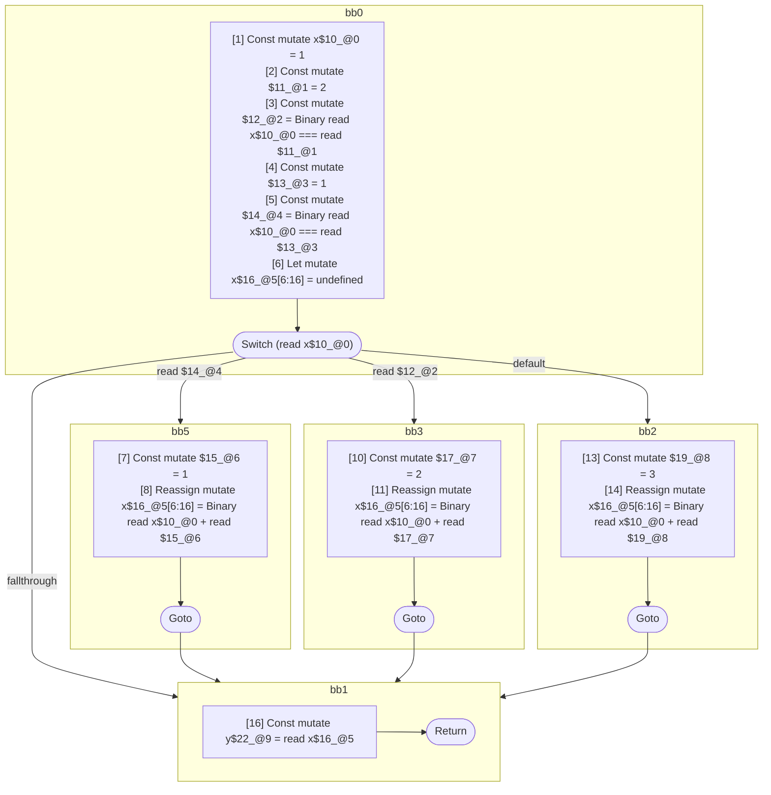

## Input

```javascript
function foo() {
  let x = 1;

  switch (x) {
    case x === 1: {
      x = x + 1;
      break;
    }
    case x === 2: {
      x = x + 2;
      break;
    }
    default: {
      x = x + 3;
    }
  }

  let y = x;
}

```

## HIR

```
bb0:
  [1] Const mutate x$10_@0 = 1
  [2] Const mutate $11_@1 = 2
  [3] Const mutate $12_@2 = Binary read x$10_@0 === read $11_@1
  [4] Const mutate $13_@3 = 1
  [5] Const mutate $14_@4 = Binary read x$10_@0 === read $13_@3
  [6] Let mutate x$16_@5[6:16] = undefined
  [6] Switch (read x$10_@0)
    Case read $14_@4: bb5
    Case read $12_@2: bb3
    Default: bb2
    Fallthrough: bb1
bb5:
  predecessor blocks: bb0
  [7] Const mutate $15_@6 = 1
  [8] Reassign mutate x$16_@5[6:16] = Binary read x$10_@0 + read $15_@6
  [9] Goto bb1
bb3:
  predecessor blocks: bb0
  [10] Const mutate $17_@7 = 2
  [11] Reassign mutate x$16_@5[6:16] = Binary read x$10_@0 + read $17_@7
  [12] Goto bb1
bb2:
  predecessor blocks: bb0
  [13] Const mutate $19_@8 = 3
  [14] Reassign mutate x$16_@5[6:16] = Binary read x$10_@0 + read $19_@8
  [15] Goto bb1
bb1:
  predecessor blocks: bb5 bb3 bb2
  [16] Const mutate y$22_@9 = read x$16_@5
  [17] Return
scope2 [3:4]:
  - dependency: read x$10_@0
  - dependency: read $11_@1
scope4 [5:6]:
  - dependency: read x$10_@0
  - dependency: read $13_@3
scope5 [6:16]:
  - dependency: read x$10_@0
scope6 [7:8]:
  - dependency: read x$10_@0
scope7 [10:11]:
  - dependency: read x$10_@0
scope8 [13:14]:
  - dependency: read x$10_@0
scope9 [16:17]:
  - dependency: read x$16_@5
```

## Reactive Scopes

```
function foo(
) {
  [1] Const mutate x$10_@0 = 1
  [2] Const mutate $11_@1 = 2
  [3] Const mutate $12_@2 = Binary read x$10_@0 === read $11_@1
  [4] Const mutate $13_@3 = 1
  [5] Const mutate $14_@4 = Binary read x$10_@0 === read $13_@3
  scope @5 [6:16] deps=[read x$10_@0] {
    [6] Let mutate x$16_@5[6:16] = undefined
    switch (read x$10_@0) {
      case read $14_@4: {
          [7] Const mutate $15_@6 = 1
          [8] Reassign mutate x$16_@5[6:16] = Binary read x$10_@0 + read $15_@6
          break bb1
      }
      case read $12_@2: {
          [10] Const mutate $17_@7 = 2
          [11] Reassign mutate x$16_@5[6:16] = Binary read x$10_@0 + read $17_@7
          break bb1
      }
      default: {
          [13] Const mutate $19_@8 = 3
          [14] Reassign mutate x$16_@5[6:16] = Binary read x$10_@0 + read $19_@8
      }
    }
  }
  [16] Const mutate y$22_@9 = read x$16_@5
  return
}

```

### CFG



## Code

```javascript
function foo$0() {
  const x$10 = 1;
  let x$16 = undefined;
  bb1: switch (x$10) {
    case x$10 === 1: {
      x$16 = x$10 + 1;
      break bb1;
    }

    case x$10 === 2: {
      x$16 = x$10 + 2;
      break bb1;
    }

    default: {
      x$16 = x$10 + 3;
    }
  }

  const y$22 = x$16;
}

```
      