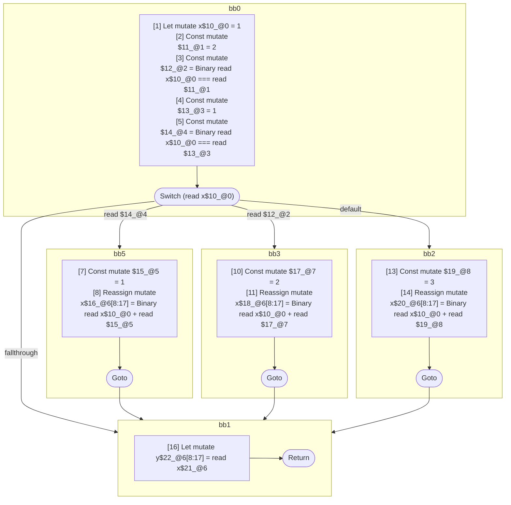

## Input

```javascript
function foo() {
  let x = 1;

  switch (x) {
    case x === 1: {
      x = x + 1;
      break;
    }
    case x === 2: {
      x = x + 2;
      break;
    }
    default: {
      x = x + 3;
    }
  }

  let y = x;
}

```

## HIR

```
bb0:
  [1] Let mutate x$10_@0 = 1
  [2] Const mutate $11_@1 = 2
  [3] Const mutate $12_@2 = Binary read x$10_@0 === read $11_@1
  [4] Const mutate $13_@3 = 1
  [5] Const mutate $14_@4 = Binary read x$10_@0 === read $13_@3
  [6] Switch (read x$10_@0)
    Case read $14_@4: bb5
    Case read $12_@2: bb3
    Default: bb2
bb5:
  predecessor blocks: bb0
  [7] Const mutate $15_@5 = 1
  [8] Reassign mutate x$16_@6[8:17] = Binary read x$10_@0 + read $15_@5
  [9] Goto bb1
bb3:
  predecessor blocks: bb0
  [10] Const mutate $17_@7 = 2
  [11] Reassign mutate x$18_@6[8:17] = Binary read x$10_@0 + read $17_@7
  [12] Goto bb1
bb2:
  predecessor blocks: bb0
  [13] Const mutate $19_@8 = 3
  [14] Reassign mutate x$20_@6[8:17] = Binary read x$10_@0 + read $19_@8
  [15] Goto bb1
bb1:
  predecessor blocks: bb5 bb3 bb2
  x$21_@6[8:17]: phi(bb5: x$16_@6, bb3: x$18_@6, bb2: x$20_@6)
  [16] Let mutate y$22_@6[8:17] = read x$21_@6
  [17] Return
```

### CFG



## Code

```javascript
function foo$0() {
  let x$1 = 1;
  bb1: switch (x$1) {
    case x$1 === 1: {
      x$1 = x$1 + 1;
      break bb1;
    }

    case x$1 === 2: {
      x$1 = x$1 + 2;
      break bb1;
    }

    default: {
      x$1 = x$1 + 3;
    }
  }

  let y$9 = x$1;
}

```
      