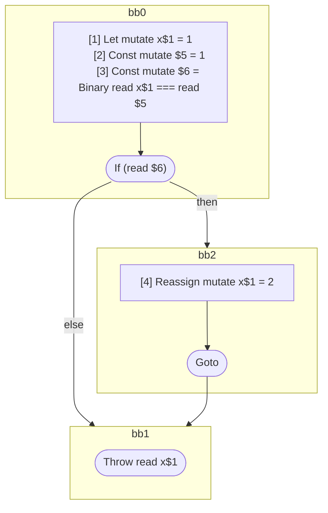

## Input

```javascript
function foo() {
  let x = 1;
  if (x === 1) {
    x = 2;
  }
  throw x;
}

```

## HIR

```
bb0:
  [1] Let mutate x$1 = 1
  [2] Const mutate $5 = 1
  [3] Const mutate $6 = Binary read x$1 === read $5
  If (read $6) then:bb2 else:bb1
bb2:
  predecessor blocks: bb0
  [4] Reassign mutate x$1 = 2
  Goto bb1
bb1:
  predecessor blocks: bb2 bb0
  Throw read x$1
```

### CFG



## Code

```javascript
function foo$0() {
  let x$1 = 1;
  bb1: if (x$1 === 1) {
    x$1 = 2;
  }

  throw x$1;
}

```
      