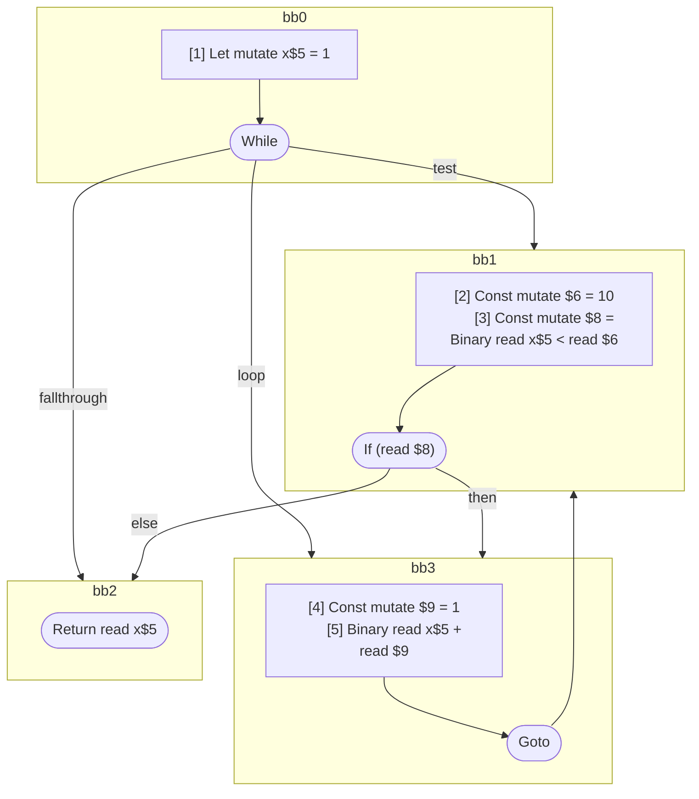

## Input

```javascript
function foo() {
  let x = 1;
  while (x < 10) {
    x + 1;
  }

  return x;
}

```

## HIR

```
bb0:
  [1] Let mutate x$5 = 1
  While test=bb1 loop=bb3 fallthrough=bb2
bb1:
  predecessor blocks: bb0 bb3
  [2] Const mutate $6 = 10
  [3] Const mutate $8 = Binary read x$5 < read $6
  If (read $8) then:bb3 else:bb2
bb3:
  predecessor blocks: bb1
  [4] Const mutate $9 = 1
  [5] Binary read x$5 + read $9
  Goto(Continue) bb1
bb2:
  predecessor blocks: bb1
  Return read x$5
```

### CFG



## Code

```javascript
function foo$0() {
  let x$5 = 1;
  bb2: while (x$5 < 10) {
    x$5 + 1;
  }

  return x$5;
}

```
      