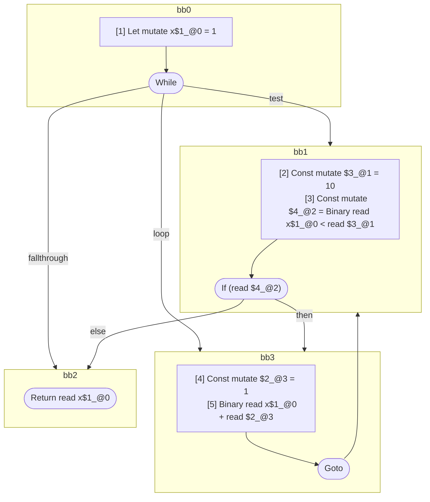

## Input

```javascript
function foo() {
  let x = 1;
  while (x < 10) {
    x + 1;
  }

  return x;
}

```

## HIR

```
bb0:
  [1] Let mutate x$1_@0 = 1
  While test=bb1 loop=bb3 fallthrough=bb2
bb1:
  predecessor blocks: bb0 bb3
  [2] Const mutate $3_@1 = 10
  [3] Const mutate $4_@2 = Binary read x$1_@0 < read $3_@1
  If (read $4_@2) then:bb3 else:bb2
bb3:
  predecessor blocks: bb1
  [4] Const mutate $2_@3 = 1
  [5] Binary read x$1_@0 + read $2_@3
  Goto(Continue) bb1
bb2:
  predecessor blocks: bb1
  Return read x$1_@0
```

### CFG



## Code

```javascript
function foo$0() {
  let x$1 = 1;
  bb2: while (x$1 < 10) {
    x$1 + 1;
  }

  return x$1;
}

```
      