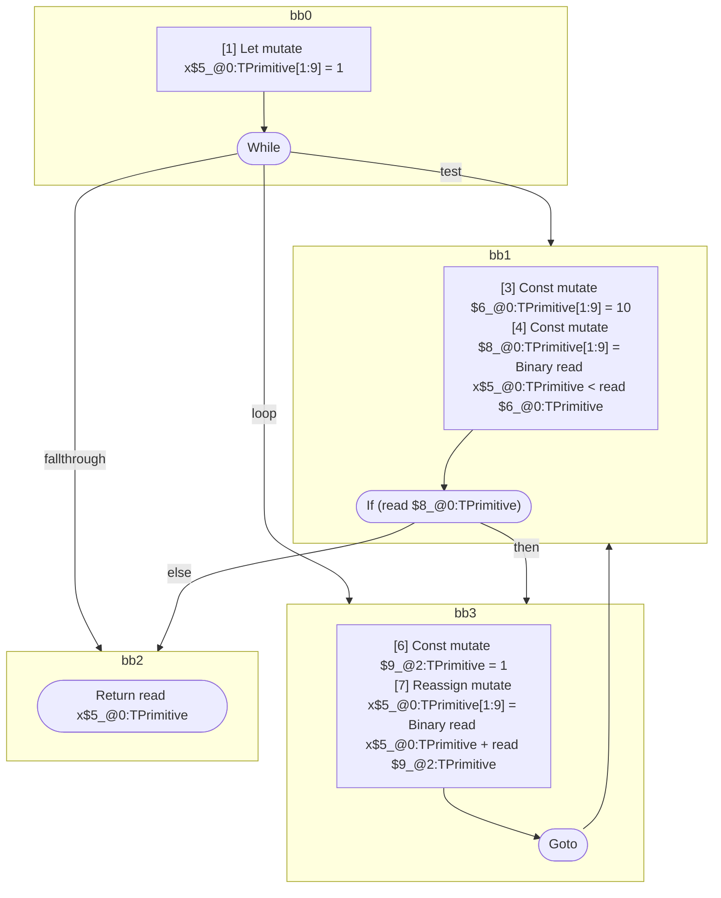

## Input

```javascript
function foo() {
  let x = 1;
  while (x < 10) {
    x = x + 1;
  }

  return x;
}

```

## HIR

```
bb0:
  [1] Let mutate x$5_@0:TPrimitive[1:9] = 1
  [2] While test=bb1 loop=bb3 fallthrough=bb2
bb1:
  predecessor blocks: bb0 bb3
  [3] Const mutate $6_@0:TPrimitive[1:9] = 10
  [4] Const mutate $8_@0:TPrimitive[1:9] = Binary read x$5_@0:TPrimitive < read $6_@0:TPrimitive
  [5] If (read $8_@0:TPrimitive) then:bb3 else:bb2 fallthrough=bb2
bb3:
  predecessor blocks: bb1
  [6] Const mutate $9_@2:TPrimitive = 1
  [7] Reassign mutate x$5_@0:TPrimitive[1:9] = Binary read x$5_@0:TPrimitive + read $9_@2:TPrimitive
  [8] Goto(Continue) bb1
bb2:
  predecessor blocks: bb1
  [9] Return read x$5_@0:TPrimitive

```

## Reactive Scopes

```
function foo(
) {
  scope @0 [1:9] deps=[] {
    [1] Let mutate x$5_@0:TPrimitive[1:9] = 1
    while (
      [3] Const mutate $6_@0:TPrimitive[1:9] = 10
      [4] Const mutate $8_@0:TPrimitive[1:9] = Binary read x$5_@0:TPrimitive < read $6_@0:TPrimitive
      read $8_@0:TPrimitive
    ) {
      [6] Const mutate $9_@2:TPrimitive = 1
      [7] Reassign mutate x$5_@0:TPrimitive[1:9] = Binary read x$5_@0:TPrimitive + read $9_@2:TPrimitive
    }
  }
  return read x$5_@0:TPrimitive
}

```

### CFG



## Code

```javascript
function foo$0() {
  let x$5 = 1;
  bb2: while (x$5 < 10) {
    x$5 = x$5 + 1;
  }

  return x$5;
}

```
      