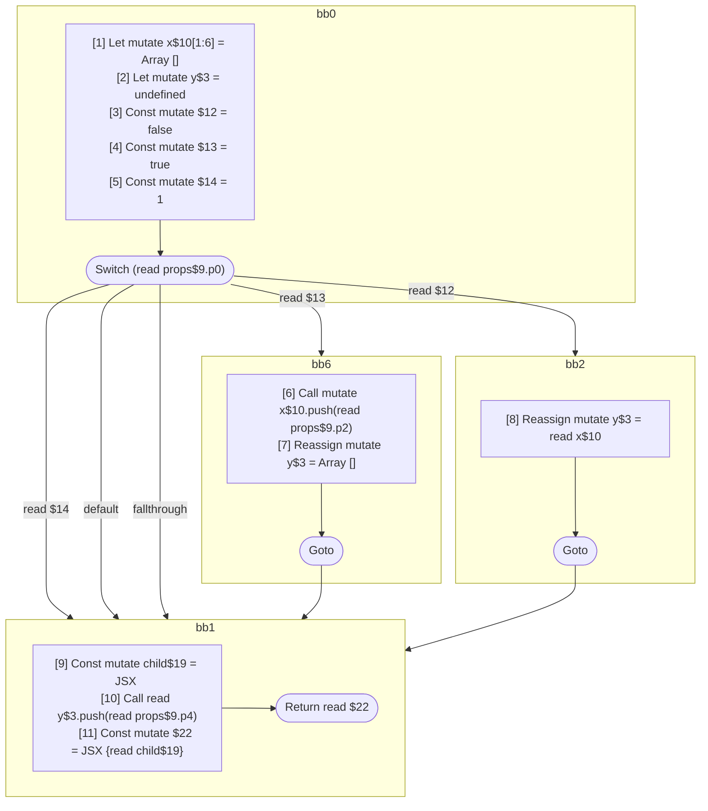

## Input

```javascript
function Component(props) {
  let x = [];
  let y;
  switch (props.p0) {
    case 1: {
      break;
    }
    case true: {
      x.push(props.p2);
      y = [];
    }
    default: {
      break;
    }
    case false: {
      y = x;
      break;
    }
  }
  const child = <Component data={x} />;
  y.push(props.p4);
  return <Component data={y}>{child}</Component>;
}

```

## HIR

```
bb0:
  [1] Let mutate x$10[1:6] = Array []
  [2] Let mutate y$3 = undefined
  [3] Const mutate $12 = false
  [4] Const mutate $13 = true
  [5] Const mutate $14 = 1
  Switch (read props$9.p0)
    Case read $14: bb1
    Case read $13: bb6
    Default: bb1
    Case read $12: bb2
bb6:
  predecessor blocks: bb0
  [6] Call mutate x$10.push(read props$9.p2)
  [7] Reassign mutate y$3 = Array []
  Goto bb1
bb2:
  predecessor blocks: bb0
  [8] Reassign mutate y$3 = read x$10
  Goto bb1
bb1:
  predecessor blocks: bb0 bb6 bb2
  [9] Const mutate child$19 = JSX <read Component$0 data={freeze x$10} ></read Component$0>
  [10] Call read y$3.push(read props$9.p4)
  [11] Const mutate $22 = JSX <read Component$0 data={freeze y$3} >{read child$19}</read Component$0>
  Return read $22
```

### CFG



## Code

```javascript
function Component$0(props$9) {
  let x$10 = [];
  let y$3 = undefined;
  bb1: switch (props$9.p0) {
    case 1: {
      break bb1;
    }

    case true: {
      x$10.push(props$9.p2);
      y$3 = [];
      break bb1;
    }

    default: {
      break bb1;
    }

    case false: {
      y$3 = x$10;
    }
  }

  const child$19 = <Component$0 data={x$10}></Component$0>;
  y$3.push(props$9.p4);
  return <Component$0 data={y$3}>{child$19}</Component$0>;
}

```
      