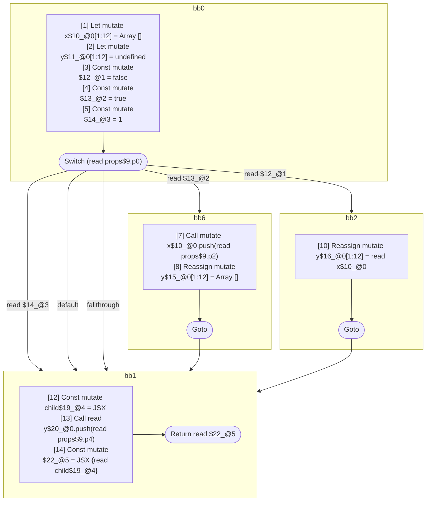

## Input

```javascript
function Component(props) {
  let x = [];
  let y;
  switch (props.p0) {
    case 1: {
      break;
    }
    case true: {
      x.push(props.p2);
      y = [];
    }
    default: {
      break;
    }
    case false: {
      y = x;
      break;
    }
  }
  const child = <Component data={x} />;
  y.push(props.p4);
  return <Component data={y}>{child}</Component>;
}

```

## HIR

```
bb0:
  [1] Let mutate x$10_@0[1:12] = Array []
  [2] Let mutate y$11_@0[1:12] = undefined
  [3] Const mutate $12_@1 = false
  [4] Const mutate $13_@2 = true
  [5] Const mutate $14_@3 = 1
  [6] Switch (read props$9.p0)
    Case read $14_@3: bb1
    Case read $13_@2: bb6
    Default: bb1
    Case read $12_@1: bb2
    Fallthrough: bb1
bb6:
  predecessor blocks: bb0
  [7] Call mutate x$10_@0.push(read props$9.p2)
  [8] Reassign mutate y$15_@0[1:12] = Array []
  [9] Goto bb1
bb2:
  predecessor blocks: bb0
  [10] Reassign mutate y$16_@0[1:12] = read x$10_@0
  [11] Goto bb1
bb1:
  predecessor blocks: bb0 bb6 bb2
  y$20_@0[1:12]: phi(bb0: y$11_@0, bb6: y$15_@0, bb2: y$16_@0)
  [12] Const mutate child$19_@4 = JSX <read Component$0 data={freeze x$10_@0} ></read Component$0>
  [13] Call read y$20_@0.push(read props$9.p4)
  [14] Const mutate $22_@5 = JSX <read Component$0 data={freeze y$20_@0} >{read child$19_@4}</read Component$0>
  [15] Return read $22_@5
scope0 [1:12]:
 - read props$9.p2
 - read props$9.p0
scope4 [12:13]:
 - read Component$0
 - freeze x$10_@0
 - read props$9.p4
scope5 [14:15]:
 - read Component$0
 - read child$19_@4
```

### CFG



## Code

```javascript
function Component$0(props$9) {
  const x$10 = [];
  let y$11 = undefined;
  bb1: switch (props$9.p0) {
    case 1: {
      break bb1;
    }

    case true: {
      x$10.push(props$9.p2);
      y$11 = [];
      break bb1;
    }

    default: {
      break bb1;
    }

    case false: {
      y$11 = x$10;
    }
  }

  const child$19 = <Component$0 data={x$10}></Component$0>;
  y$11.push(props$9.p4);
  return <Component$0 data={y$11}>{child$19}</Component$0>;
}

```
      