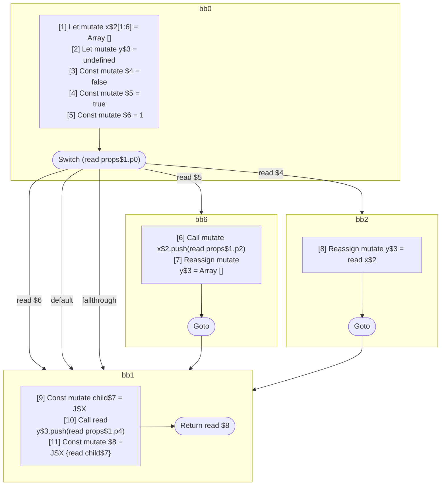

## Input

```javascript
function Component(props) {
  let x = [];
  let y;
  switch (props.p0) {
    case 1: {
      break;
    }
    case true: {
      x.push(props.p2);
      y = [];
    }
    default: {
      break;
    }
    case false: {
      y = x;
      break;
    }
  }
  const child = <Component data={x} />;
  y.push(props.p4);
  return <Component data={y}>{child}</Component>;
}

```

## HIR

```
bb0:
  [1] Let mutate x$2[1:6] = Array []
  [2] Let mutate y$3 = undefined
  [3] Const mutate $4 = false
  [4] Const mutate $5 = true
  [5] Const mutate $6 = 1
  Switch (read props$1.p0)
    Case read $6: bb1
    Case read $5: bb6
    Default: bb1
    Case read $4: bb2
bb6:
  predecessor blocks: bb0
  [6] Call mutate x$2.push(read props$1.p2)
  [7] Reassign mutate y$3 = Array []
  Goto bb1
bb2:
  predecessor blocks: bb0
  [8] Reassign mutate y$3 = read x$2
  Goto bb1
bb1:
  predecessor blocks: bb0 bb6 bb2
  [9] Const mutate child$7 = JSX <read Component$0 data={freeze x$2} ></read Component$0>
  [10] Call read y$3.push(read props$1.p4)
  [11] Const mutate $8 = JSX <read Component$0 data={freeze y$3} >{read child$7}</read Component$0>
  Return read $8
```

### CFG



## Code

```javascript
function Component$0(props$1) {
  let x$2 = [];
  let y$3 = undefined;
  bb1: switch (props$1.p0) {
    case 1: {
      break bb1;
    }

    case true: {
      x$2.push(props$1.p2);
      y$3 = [];
      break bb1;
    }

    default: {
      break bb1;
    }

    case false: {
      y$3 = x$2;
    }
  }

  const child$7 = <Component$0 data={x$2}></Component$0>;
  y$3.push(props$1.p4);
  return <Component$0 data={y$3}>{child$7}</Component$0>;
}

```
      