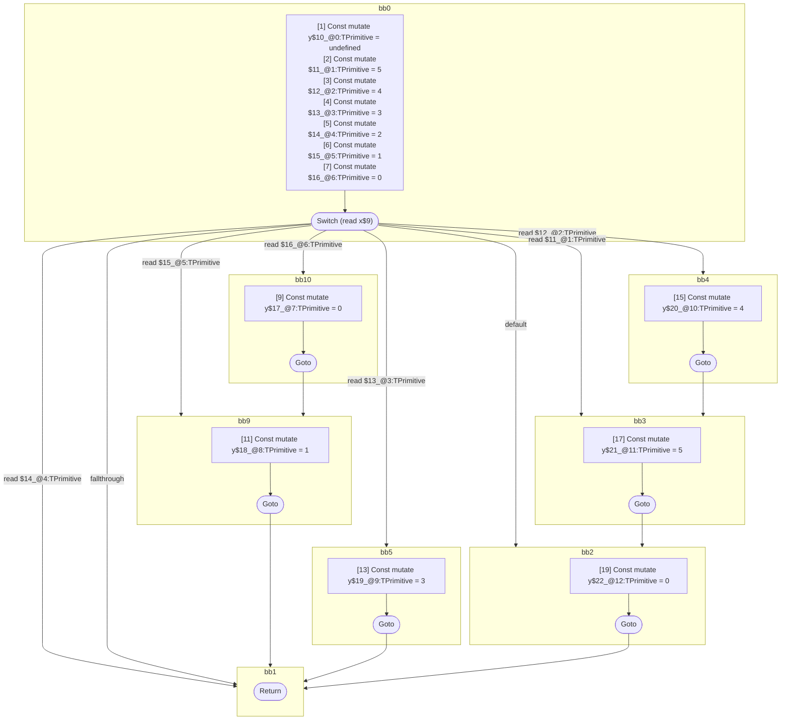

## Input

```javascript
function foo(x) {
  let y;
  switch (x) {
    case 0: {
      y = 0;
    }
    case 1: {
      y = 1;
    }
    case 2: {
      break;
    }
    case 3: {
      y = 3;
      break;
    }
    case 4: {
      y = 4;
    }
    case 5: {
      y = 5;
    }
    default: {
      y = 0;
    }
  }
}

```

## HIR

```
bb0:
  [1] Const mutate y$10_@0:TPrimitive = undefined
  [2] Const mutate $11_@1:TPrimitive = 5
  [3] Const mutate $12_@2:TPrimitive = 4
  [4] Const mutate $13_@3:TPrimitive = 3
  [5] Const mutate $14_@4:TPrimitive = 2
  [6] Const mutate $15_@5:TPrimitive = 1
  [7] Const mutate $16_@6:TPrimitive = 0
  [8] Switch (read x$9)
    Case read $16_@6:TPrimitive: bb10
    Case read $15_@5:TPrimitive: bb9
    Case read $14_@4:TPrimitive: bb1
    Case read $13_@3:TPrimitive: bb5
    Case read $12_@2:TPrimitive: bb4
    Case read $11_@1:TPrimitive: bb3
    Default: bb2
    Fallthrough: bb1
bb10:
  predecessor blocks: bb0
  [9] Const mutate y$17_@7:TPrimitive = 0
  [10] Goto bb9
bb9:
  predecessor blocks: bb10 bb0
  [11] Const mutate y$18_@8:TPrimitive = 1
  [12] Goto bb1
bb5:
  predecessor blocks: bb0
  [13] Const mutate y$19_@9:TPrimitive = 3
  [14] Goto bb1
bb4:
  predecessor blocks: bb0
  [15] Const mutate y$20_@10:TPrimitive = 4
  [16] Goto bb3
bb3:
  predecessor blocks: bb4 bb0
  [17] Const mutate y$21_@11:TPrimitive = 5
  [18] Goto bb2
bb2:
  predecessor blocks: bb3 bb0
  [19] Const mutate y$22_@12:TPrimitive = 0
  [20] Goto bb1
bb1:
  predecessor blocks: bb9 bb0 bb5 bb2
  [21] Return

```

## Reactive Scopes

```
function foo(
  x,
) {
  [1] Const mutate y$10_@0:TPrimitive = undefined
  [2] Const mutate $11_@1:TPrimitive = 5
  [3] Const mutate $12_@2:TPrimitive = 4
  [4] Const mutate $13_@3:TPrimitive = 3
  [5] Const mutate $14_@4:TPrimitive = 2
  [6] Const mutate $15_@5:TPrimitive = 1
  [7] Const mutate $16_@6:TPrimitive = 0
  switch (read x$9) {
    case read $16_@6:TPrimitive: {
        [9] Const mutate y$17_@7:TPrimitive = 0
    }
    case read $15_@5:TPrimitive: {
        [11] Const mutate y$18_@8:TPrimitive = 1
        break bb1
    }
    case read $14_@4:TPrimitive: {
        break bb1
    }
    case read $13_@3:TPrimitive: {
        [13] Const mutate y$19_@9:TPrimitive = 3
        break bb1
    }
    case read $12_@2:TPrimitive: {
        [15] Const mutate y$20_@10:TPrimitive = 4
    }
    case read $11_@1:TPrimitive: {
        [17] Const mutate y$21_@11:TPrimitive = 5
    }
    default: {
        [19] Const mutate y$22_@12:TPrimitive = 0
    }
  }
  return
}

```

### CFG



## Code

```javascript
function foo$0(x$9) {
  const y$10 = undefined;
  bb1: switch (x$9) {
    case 0: {
      const y$17 = 0;
    }

    case 1: {
      const y$18 = 1;
      break bb1;
    }

    case 2: {
      break bb1;
    }

    case 3: {
      const y$19 = 3;
      break bb1;
    }

    case 4: {
      const y$20 = 4;
    }

    case 5: {
      const y$21 = 5;
    }

    default: {
      const y$22 = 0;
    }
  }
}

```
      