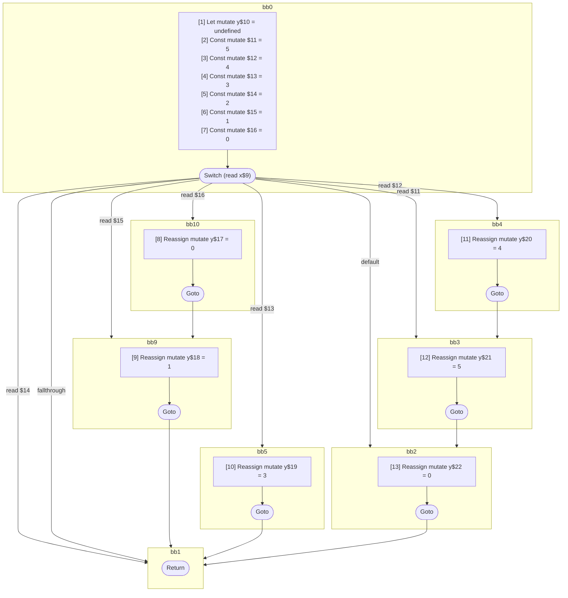

## Input

```javascript
function foo(x) {
  let y;
  switch (x) {
    case 0: {
      y = 0;
    }
    case 1: {
      y = 1;
    }
    case 2: {
      break;
    }
    case 3: {
      y = 3;
      break;
    }
    case 4: {
      y = 4;
    }
    case 5: {
      y = 5;
    }
    default: {
      y = 0;
    }
  }
}

```

## HIR

```
bb0:
  [1] Let mutate y$10 = undefined
  [2] Const mutate $11 = 5
  [3] Const mutate $12 = 4
  [4] Const mutate $13 = 3
  [5] Const mutate $14 = 2
  [6] Const mutate $15 = 1
  [7] Const mutate $16 = 0
  Switch (read x$9)
    Case read $16: bb10
    Case read $15: bb9
    Case read $14: bb1
    Case read $13: bb5
    Case read $12: bb4
    Case read $11: bb3
    Default: bb2
bb10:
  predecessor blocks: bb0
  [8] Reassign mutate y$17 = 0
  Goto bb9
bb9:
  predecessor blocks: bb10 bb0
  [9] Reassign mutate y$18 = 1
  Goto bb1
bb5:
  predecessor blocks: bb0
  [10] Reassign mutate y$19 = 3
  Goto bb1
bb4:
  predecessor blocks: bb0
  [11] Reassign mutate y$20 = 4
  Goto bb3
bb3:
  predecessor blocks: bb4 bb0
  [12] Reassign mutate y$21 = 5
  Goto bb2
bb2:
  predecessor blocks: bb3 bb0
  [13] Reassign mutate y$22 = 0
  Goto bb1
bb1:
  predecessor blocks: bb9 bb0 bb5 bb2
  Return
```

### CFG



## Code

```javascript
function foo$0(x$9) {
  let y$10 = undefined;
  bb1: switch (x$9) {
    case 0: {
      y$17 = 0;
    }

    case 1: {
      y$18 = 1;
      break bb1;
    }

    case 2: {
      break bb1;
    }

    case 3: {
      y$19 = 3;
      break bb1;
    }

    case 4: {
      y$20 = 4;
    }

    case 5: {
      y$21 = 5;
    }

    default: {
      y$22 = 0;
    }
  }

  return;
}

```
      