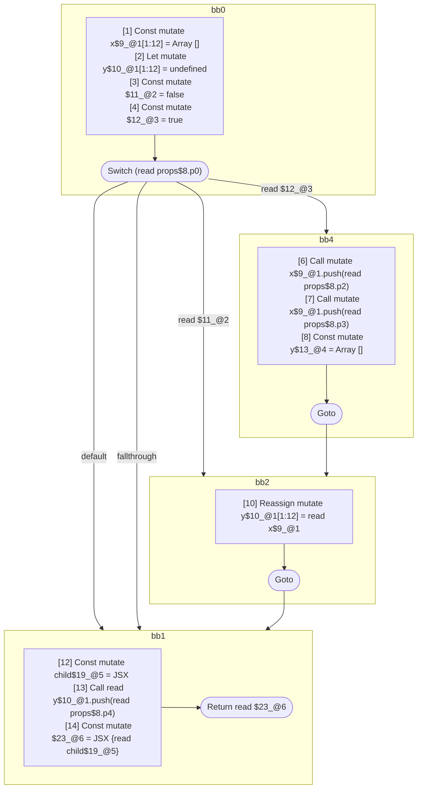

## Input

```javascript
// @Out DefUseGraph
function Component(props) {
  let x = [];
  let y;
  switch (props.p0) {
    case true: {
      x.push(props.p2);
      x.push(props.p3);
      y = [];
    }
    case false: {
      y = x;
      break;
    }
  }
  const child = <Component data={x} />;
  y.push(props.p4);
  return <Component data={y}>{child}</Component>;
}

```

## HIR

```
bb0:
  [1] Const mutate x$9_@1[1:12] = Array []
  [2] Let mutate y$10_@1[1:12] = undefined
  [3] Const mutate $11_@2 = false
  [4] Const mutate $12_@3 = true
  [5] Switch (read props$8.p0)
    Case read $12_@3: bb4
    Case read $11_@2: bb2
    Default: bb1
    Fallthrough: bb1
bb4:
  predecessor blocks: bb0
  [6] Call mutate x$9_@1.push(read props$8.p2)
  [7] Call mutate x$9_@1.push(read props$8.p3)
  [8] Const mutate y$13_@4 = Array []
  [9] Goto bb2
bb2:
  predecessor blocks: bb4 bb0
  [10] Reassign mutate y$10_@1[1:12] = read x$9_@1
  [11] Goto bb1
bb1:
  predecessor blocks: bb2 bb0
  [12] Const mutate child$19_@5 = JSX <read Component$0 data={freeze x$9_@1} ></read Component$0>
  [13] Call read y$10_@1.push(read props$8.p4)
  [14] Const mutate $23_@6 = JSX <read Component$0 data={read y$10_@1} >{read child$19_@5}</read Component$0>
  [15] Return read $23_@6
scope5 [12:13]:
  - dependency: read Component$0
  - dependency: freeze x$9_@1
  - dependency: read y$10_@1.push
  - dependency: read props$8.p4
scope6 [14:15]:
  - dependency: read Component$0
  - dependency: read y$10_@1
  - dependency: read child$19_@5
```

## Reactive Scopes

```
function Component(
  props,
) {
  scope @1 [1:12] deps=[] {
    [1] Const mutate x$9_@1[1:12] = Array []
    [2] Let mutate y$10_@1[1:12] = undefined
    [3] Const mutate $11_@2 = false
    [4] Const mutate $12_@3 = true
    switch (read props$8.p0) {
      case read $12_@3: {
          [6] Call mutate x$9_@1.push(read props$8.p2)
          [7] Call mutate x$9_@1.push(read props$8.p3)
          scope @4 [8:9] deps=[] {
            [8] Const mutate y$13_@4 = Array []
          }
      }
      case read $11_@2: {
          [10] Reassign mutate y$10_@1[1:12] = read x$9_@1
      }
    }
  }
  scope @5 [12:13] deps=[read Component$0, freeze x$9_@1, read y$10_@1.push, read props$8.p4] {
    [12] Const mutate child$19_@5 = JSX <read Component$0 data={freeze x$9_@1} ></read Component$0>
  }
  [13] Call read y$10_@1.push(read props$8.p4)
  scope @6 [14:15] deps=[read Component$0, read y$10_@1, read child$19_@5] {
    [14] Const mutate $23_@6 = JSX <read Component$0 data={read y$10_@1} >{read child$19_@5}</read Component$0>
  }
  return read $23_@6
}

```

### CFG



## Code

```javascript
function Component$0(props$8) {
  const x$9 = [];
  let y$10 = undefined;
  bb1: switch (props$8.p0) {
    case true: {
      x$9.push(props$8.p2);
      x$9.push(props$8.p3);
      const y$13 = [];
    }

    case false: {
      y$10 = x$9;
    }
  }

  const child$19 = <Component$0 data={x$9}></Component$0>;
  y$10.push(props$8.p4);
  return <Component$0 data={y$10}>{child$19}</Component$0>;
}

```
      