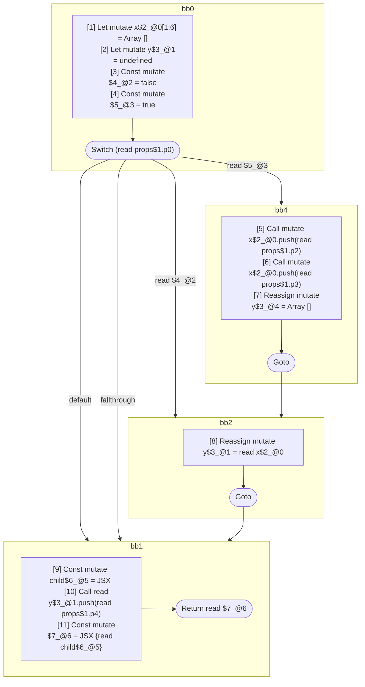

## Input

```javascript
// @Out DefUseGraph
function Component(props) {
  let x = [];
  let y;
  switch (props.p0) {
    case true: {
      x.push(props.p2);
      x.push(props.p3);
      y = [];
    }
    case false: {
      y = x;
      break;
    }
  }
  const child = <Component data={x} />;
  y.push(props.p4);
  return <Component data={y}>{child}</Component>;
}

```

## HIR

```
bb0:
  [1] Let mutate x$2_@0[1:6] = Array []
  [2] Let mutate y$3_@1 = undefined
  [3] Const mutate $4_@2 = false
  [4] Const mutate $5_@3 = true
  Switch (read props$1.p0)
    Case read $5_@3: bb4
    Case read $4_@2: bb2
    Default: bb1
bb4:
  predecessor blocks: bb0
  [5] Call mutate x$2_@0.push(read props$1.p2)
  [6] Call mutate x$2_@0.push(read props$1.p3)
  [7] Reassign mutate y$3_@4 = Array []
  Goto bb2
bb2:
  predecessor blocks: bb4 bb0
  [8] Reassign mutate y$3_@1 = read x$2_@0
  Goto bb1
bb1:
  predecessor blocks: bb2 bb0
  [9] Const mutate child$6_@5 = JSX <read Component$0 data={freeze x$2_@0} ></read Component$0>
  [10] Call read y$3_@1.push(read props$1.p4)
  [11] Const mutate $7_@6 = JSX <read Component$0 data={read y$3_@1} >{read child$6_@5}</read Component$0>
  Return read $7_@6
```

### CFG



## Code

```javascript
function Component$0(props$1) {
  let x$2 = [];
  let y$3 = undefined;
  bb1: switch (props$1.p0) {
    case true: {
      x$2.push(props$1.p2);
      x$2.push(props$1.p3);
      y$3 = [];
    }

    case false: {
      y$3 = x$2;
    }
  }

  const child$6 = <Component$0 data={x$2}></Component$0>;
  y$3.push(props$1.p4);
  return <Component$0 data={y$3}>{child$6}</Component$0>;
}

```
      