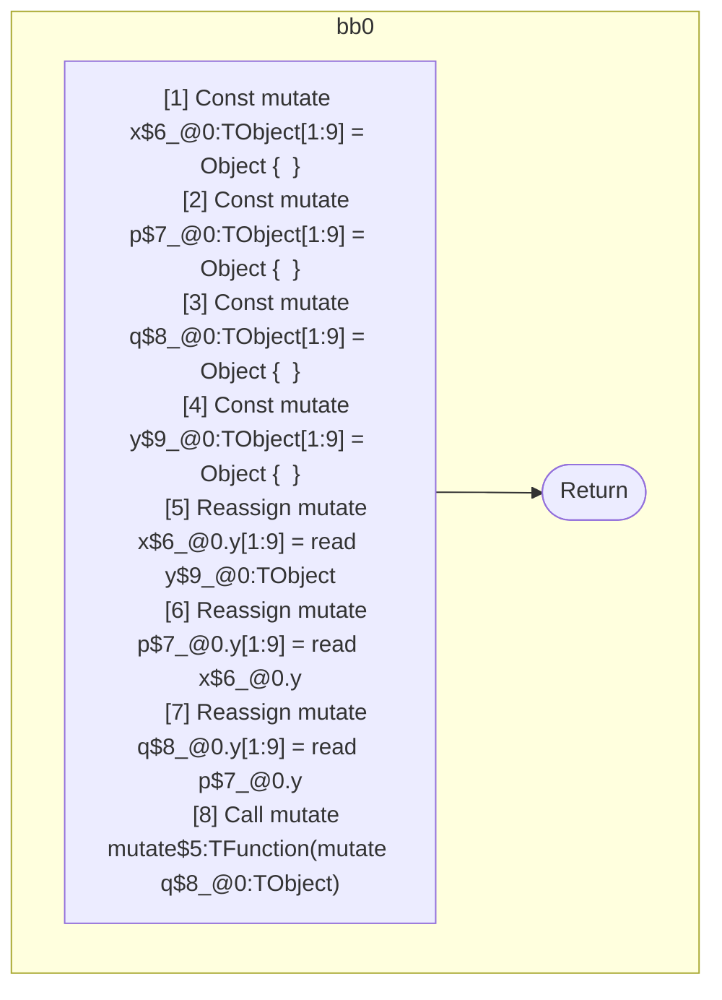

## Input

```javascript
function component() {
  let x = {};
  let p = {};
  let q = {};
  let y = {};

  x.y = y;
  p.y = x.y;
  q.y = p.y;

  mutate(q);
}

```

## HIR

```
bb0:
  [1] Const mutate x$6_@0:TObject[1:9] = Object {  }
  [2] Const mutate p$7_@0:TObject[1:9] = Object {  }
  [3] Const mutate q$8_@0:TObject[1:9] = Object {  }
  [4] Const mutate y$9_@0:TObject[1:9] = Object {  }
  [5] Reassign mutate x$6_@0.y[1:9] = read y$9_@0:TObject
  [6] Reassign mutate p$7_@0.y[1:9] = read x$6_@0.y
  [7] Reassign mutate q$8_@0.y[1:9] = read p$7_@0.y
  [8] Call mutate mutate$5:TFunction(mutate q$8_@0:TObject)
  [9] Return

```

## Reactive Scopes

```
function component(
) {
  scope @0 [1:9] deps=[] {
    [1] Const mutate x$6_@0:TObject[1:9] = Object {  }
    [2] Const mutate p$7_@0:TObject[1:9] = Object {  }
    [3] Const mutate q$8_@0:TObject[1:9] = Object {  }
    [4] Const mutate y$9_@0:TObject[1:9] = Object {  }
    [5] Reassign mutate x$6_@0.y[1:9] = read y$9_@0:TObject
    [6] Reassign mutate p$7_@0.y[1:9] = read x$6_@0.y
    [7] Reassign mutate q$8_@0.y[1:9] = read p$7_@0.y
    [8] Call mutate mutate$5:TFunction(mutate q$8_@0:TObject)
  }
  return
}

```

### CFG



## Code

```javascript
function component$0() {
  const x$6 = {};
  const p$7 = {};
  const q$8 = {};
  const y$9 = {};
  x$6.y = y$9;
  p$7.y = x$6.y;
  q$8.y = p$7.y;
  mutate$5(q$8);
}

```
      