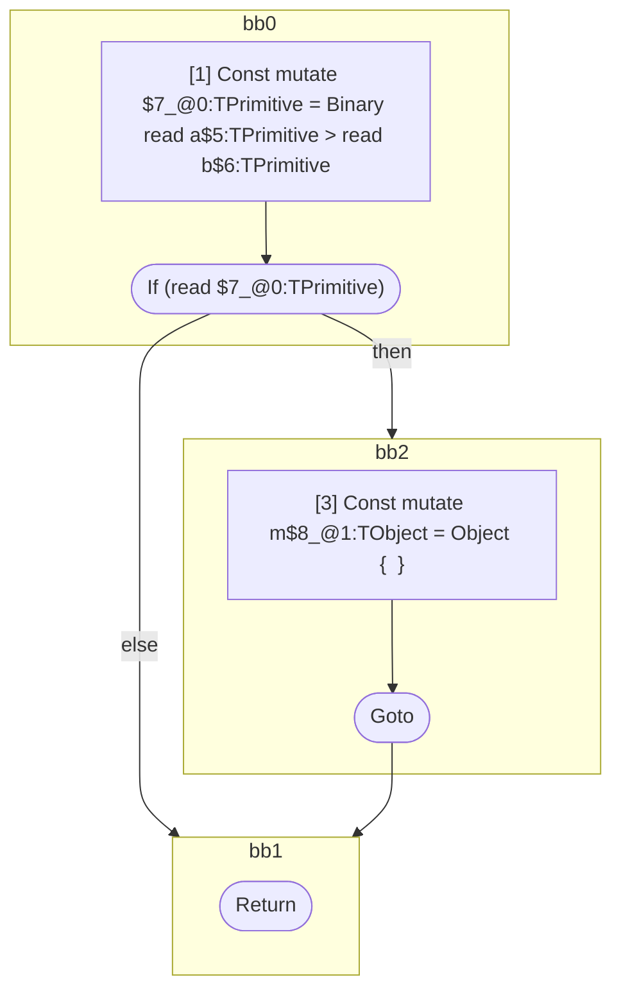

## Input

```javascript
function component(a, b) {
  if (a > b) {
    let m = {};
  }
}

```

## HIR

```
bb0:
  [1] Const mutate $7_@0:TPrimitive = Binary read a$5:TPrimitive > read b$6:TPrimitive
  [2] If (read $7_@0:TPrimitive) then:bb2 else:bb1 fallthrough=bb1
bb2:
  predecessor blocks: bb0
  [3] Const mutate m$8_@1:TObject = Object {  }
  [4] Goto bb1
bb1:
  predecessor blocks: bb2 bb0
  [5] Return
scope0 [1:2]:
  - dependency: read a$5:TPrimitive
  - dependency: read b$6:TPrimitive
```

## Reactive Scopes

```
function component(
  a,
  b,
) {
  [1] Const mutate $7_@0:TPrimitive = Binary read a$5:TPrimitive > read b$6:TPrimitive
  if (read $7_@0:TPrimitive) {
    scope @1 [3:4] deps=[] {
      [3] Const mutate m$8_@1:TObject = Object {  }
    }
  }
  return
}

```

### CFG



## Code

```javascript
function component$0(a$5, b$6) {
  bb1: if (a$5 > b$6) {
    const m$8 = {};
  }
}

```
      