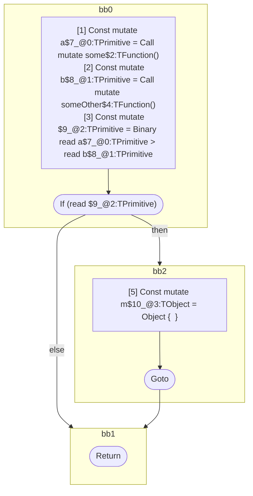

## Input

```javascript
function component() {
  let a = some();
  let b = someOther();
  if (a > b) {
    let m = {};
  }
}

```

## HIR

```
bb0:
  [1] Const mutate a$7_@0:TPrimitive = Call mutate some$2:TFunction()
  [2] Const mutate b$8_@1:TPrimitive = Call mutate someOther$4:TFunction()
  [3] Const mutate $9_@2:TPrimitive = Binary read a$7_@0:TPrimitive > read b$8_@1:TPrimitive
  [4] If (read $9_@2:TPrimitive) then:bb2 else:bb1 fallthrough=bb1
bb2:
  predecessor blocks: bb0
  [5] Const mutate m$10_@3:TObject = Object {  }
  [6] Goto bb1
bb1:
  predecessor blocks: bb2 bb0
  [7] Return
scope2 [3:4]:
  - dependency: read a$7_@0:TPrimitive
  - dependency: read b$8_@1:TPrimitive
```

## Reactive Scopes

```
function component(
) {
  scope @0 [1:2] deps=[] {
    [1] Const mutate a$7_@0:TPrimitive = Call mutate some$2:TFunction()
  }
  scope @1 [2:3] deps=[] {
    [2] Const mutate b$8_@1:TPrimitive = Call mutate someOther$4:TFunction()
  }
  [3] Const mutate $9_@2:TPrimitive = Binary read a$7_@0:TPrimitive > read b$8_@1:TPrimitive
  if (read $9_@2:TPrimitive) {
    scope @3 [5:6] deps=[] {
      [5] Const mutate m$10_@3:TObject = Object {  }
    }
  }
  return
}

```

### CFG



## Code

```javascript
function component$0() {
  const a$7 = some$2();
  const b$8 = someOther$4();
  bb1: if (a$7 > b$8) {
    const m$10 = {};
  }
}

```
      