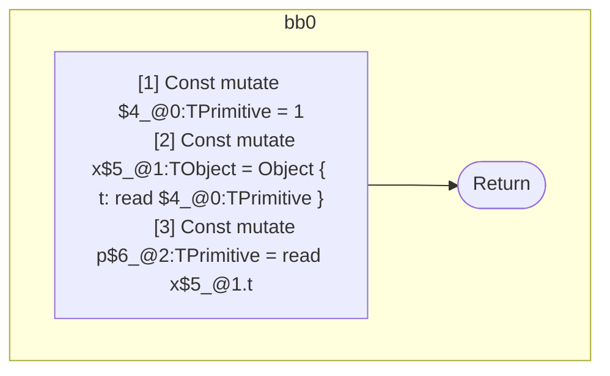

## Input

```javascript
function component() {
  let x = { t: 1 };
  let p = x.t;
}

```

## HIR

```
bb0:
  [1] Const mutate $4_@0:TPrimitive = 1
  [2] Const mutate x$5_@1:TObject = Object { t: read $4_@0:TPrimitive }
  [3] Const mutate p$6_@2:TPrimitive = read x$5_@1.t
  [4] Return
scope1 [2:3]:
  - dependency: read $4_@0:TPrimitive
scope2 [3:4]:
  - dependency: read x$5_@1.t
```

## Reactive Scopes

```
function component(
) {
  [1] Const mutate $4_@0:TPrimitive = 1
  scope @1 [2:3] deps=[read $4_@0:TPrimitive] {
    [2] Const mutate x$5_@1:TObject = Object { t: read $4_@0:TPrimitive }
  }
  [3] Const mutate p$6_@2:TPrimitive = read x$5_@1.t
  return
}

```

### CFG



## Code

```javascript
function component$0() {
  const x$5 = {
    t: 1,
  };
  const p$6 = x$5.t;
}

```
      