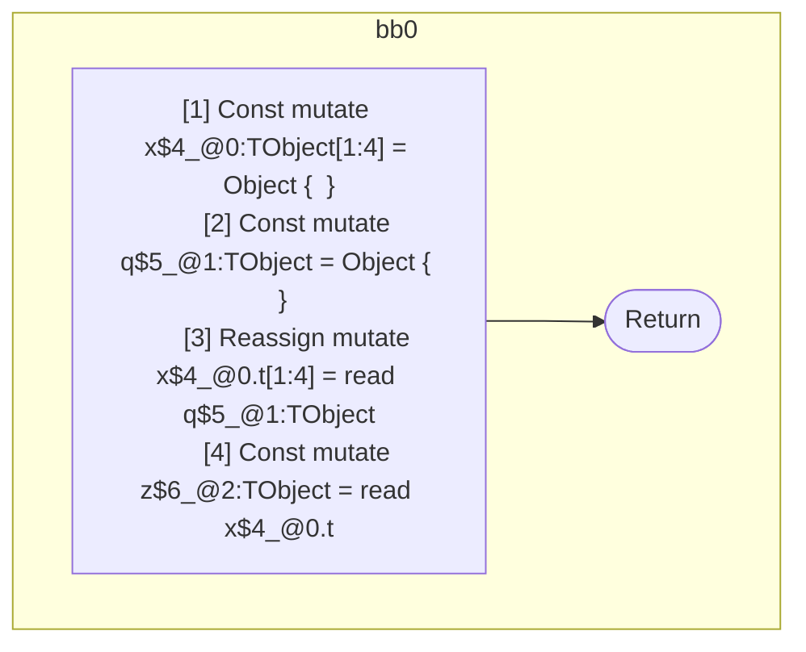

## Input

```javascript
function component() {
  let x = {};
  let q = {};
  x.t = q;
  let z = x.t;
}

```

## HIR

```
bb0:
  [1] Const mutate x$4_@0:TObject[1:4] = Object {  }
  [2] Const mutate q$5_@1:TObject = Object {  }
  [3] Reassign mutate x$4_@0.t[1:4] = read q$5_@1:TObject
  [4] Const mutate z$6_@2:TObject = read x$4_@0.t
  [5] Return
scope1 [2:3]:
  - dependency: mutate x$4_@0.t
scope2 [4:5]:
  - dependency: read x$4_@0.t
```

## Reactive Scopes

```
function component(
) {
  scope @0 [1:4] deps=[] {
    [1] Const mutate x$4_@0:TObject[1:4] = Object {  }
    scope @1 [2:3] deps=[mutate x$4_@0.t] {
      [2] Const mutate q$5_@1:TObject = Object {  }
    }
    [3] Reassign mutate x$4_@0.t[1:4] = read q$5_@1:TObject
  }
  [4] Const mutate z$6_@2:TObject = read x$4_@0.t
  return
}

```

### CFG



## Code

```javascript
function component$0() {
  const x$4 = {};
  const q$5 = {};
  x$4.t = q$5;
  const z$6 = x$4.t;
}

```
      