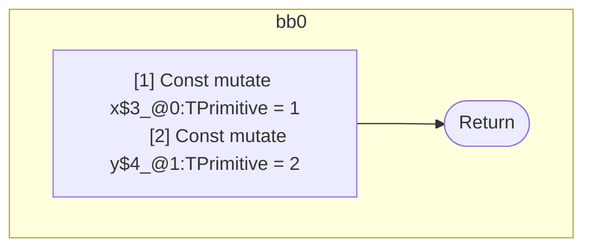

## Input

```javascript
function component() {
  let x = 1;
  let y = 2;
}

```

## HIR

```
bb0:
  [1] Const mutate x$3_@0:TPrimitive = 1
  [2] Const mutate y$4_@1:TPrimitive = 2
  [3] Return

```

## Reactive Scopes

```
function component(
) {
  [1] Const mutate x$3_@0:TPrimitive = 1
  [2] Const mutate y$4_@1:TPrimitive = 2
  return
}

```

### CFG



## Code

```javascript
function component$0() {
  const x$3 = 1;
  const y$4 = 2;
}

```
      