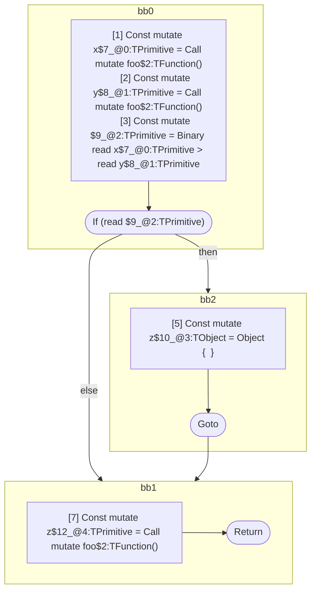

## Input

```javascript
function component() {
  let x = foo();
  let y = foo();
  if (x > y) {
    let z = {};
  }

  let z = foo();
}

```

## HIR

```
bb0:
  [1] Const mutate x$7_@0:TPrimitive = Call mutate foo$2:TFunction()
  [2] Const mutate y$8_@1:TPrimitive = Call mutate foo$2:TFunction()
  [3] Const mutate $9_@2:TPrimitive = Binary read x$7_@0:TPrimitive > read y$8_@1:TPrimitive
  [4] If (read $9_@2:TPrimitive) then:bb2 else:bb1 fallthrough=bb1
bb2:
  predecessor blocks: bb0
  [5] Const mutate z$10_@3:TObject = Object {  }
  [6] Goto bb1
bb1:
  predecessor blocks: bb2 bb0
  [7] Const mutate z$12_@4:TPrimitive = Call mutate foo$2:TFunction()
  [8] Return
scope2 [3:4]:
  - dependency: read x$7_@0:TPrimitive
  - dependency: read y$8_@1:TPrimitive
```

## Reactive Scopes

```
function component(
) {
  scope @0 [1:2] deps=[] {
    [1] Const mutate x$7_@0:TPrimitive = Call mutate foo$2:TFunction()
  }
  scope @1 [2:3] deps=[] {
    [2] Const mutate y$8_@1:TPrimitive = Call mutate foo$2:TFunction()
  }
  [3] Const mutate $9_@2:TPrimitive = Binary read x$7_@0:TPrimitive > read y$8_@1:TPrimitive
  if (read $9_@2:TPrimitive) {
    scope @3 [5:6] deps=[] {
      [5] Const mutate z$10_@3:TObject = Object {  }
    }
  }
  scope @4 [7:8] deps=[] {
    [7] Const mutate z$12_@4:TPrimitive = Call mutate foo$2:TFunction()
  }
  return
}

```

### CFG



## Code

```javascript
function component$0() {
  const x$7 = foo$2();
  const y$8 = foo$2();
  bb1: if (x$7 > y$8) {
    const z$10 = {};
  }

  const z$12 = foo$2();
}

```
      