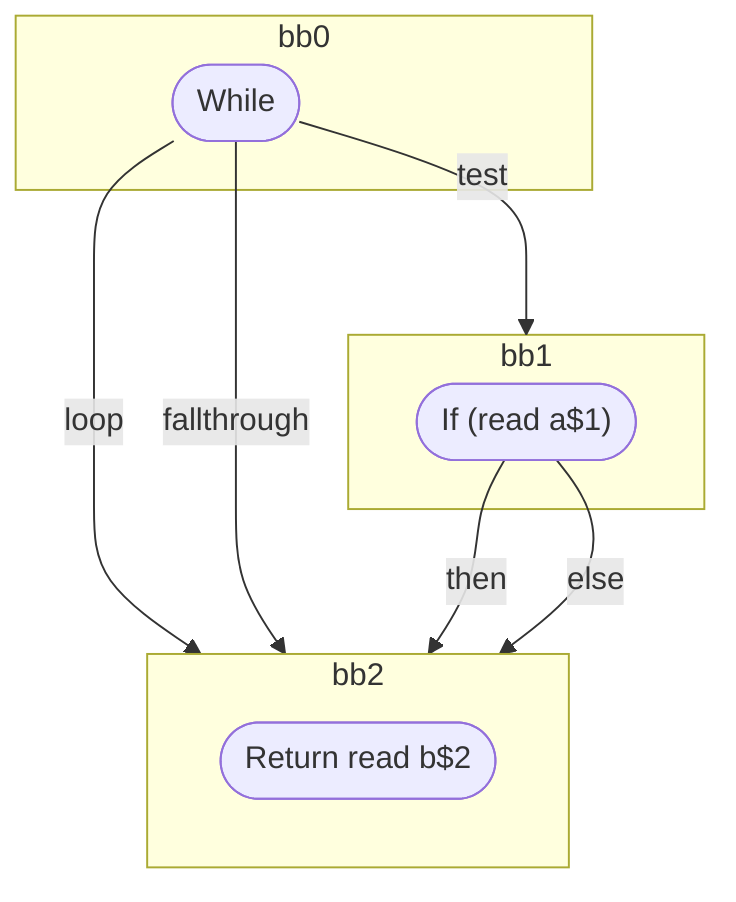

## Input

```javascript
function foo(a, b) {
  while (a) {
    break;
  }
  return b;
}

```

## HIR

```
bb0:
  While test=bb1 loop=bb2 fallthrough=bb2
bb1:
  predecessor blocks: bb0
  If (read a$1) then:bb2 else:bb2
bb2:
  predecessor blocks: bb1
  Return read b$2
```

### CFG



## Code

```javascript
function foo$0(a$1, b$2) {
  bb2: while (a$1) {
    break;
  }
  return b$2;
}

```
      