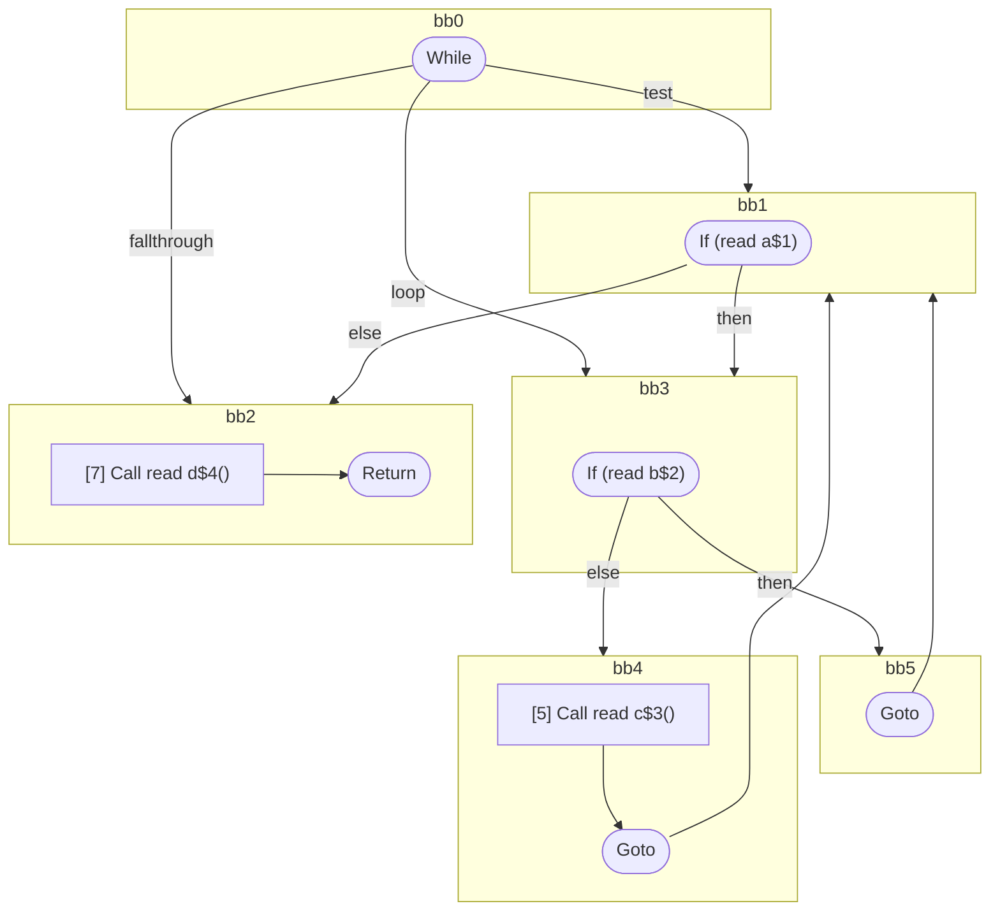

## Input

```javascript
function foo(a, b, c, d) {
  while (a) {
    if (b) {
      continue;
    }
    c();
    continue;
  }
  d();
}

```

## HIR

```
bb0:
  [1] While test=bb1 loop=bb3 fallthrough=bb2
bb1:
  predecessor blocks: bb0 bb5 bb4
  [2] If (read a$1) then:bb3 else:bb2
bb3:
  predecessor blocks: bb1
  [3] If (read b$2) then:bb5 else:bb4
bb5:
  predecessor blocks: bb3
  [4] Goto(Continue) bb1
bb4:
  predecessor blocks: bb3
  [5] Call read c$3()
  [6] Goto(Continue) bb1
bb2:
  predecessor blocks: bb1
  [7] Call read d$4()
  [8] Return
```

### CFG



## Code

```javascript
function foo$0(a$1, b$2, c$3, d$4) {
  bb2: while (a$1) {
    bb4: if (b$2) {
      continue;
    }
    c$3();
  }

  d$4();
}

```
      